# Validating baseline Azure VM Performance

After creating Azure VMs to host Cassandra ring nodes and the client-test servers, baseline synthetic performance tests were executed, to make sure that VM performance looks as expected, based on VM specifications.

## Network Latency
Use `sockperf` to check latency between a pair of VMs to confirm Accelerated Networking is working and latency is around 40-50ms.

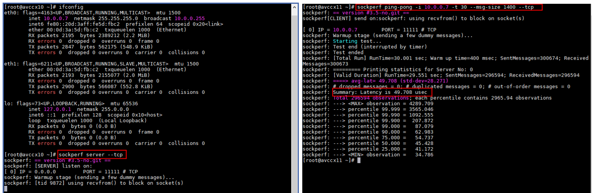

## Network Throughput
Use `iperf3` to validate maximum throughput between client and Cassandra nodes in both directions using `--reverse` parameter (should be close to ~11Gbps for `DS14_v2`).

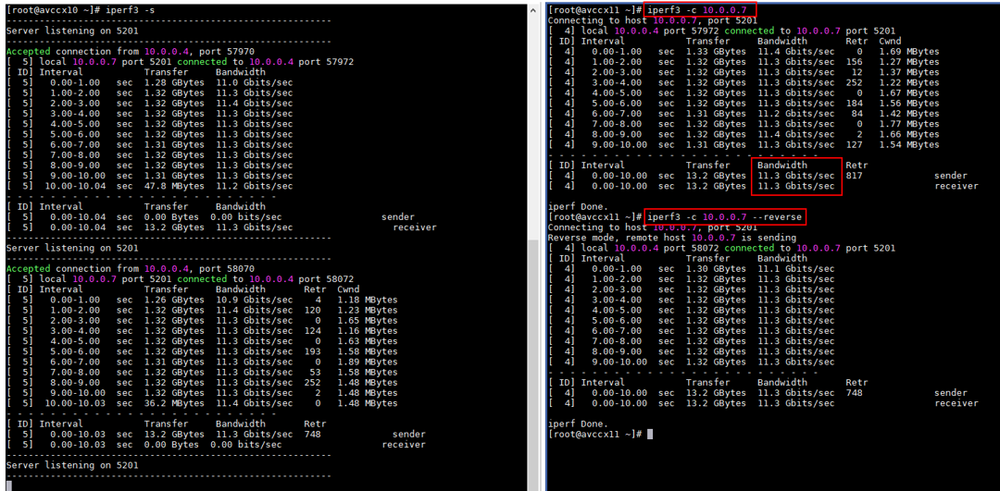

## Data Disk Throughput
Use `fio` to validate raw disk random read throughput to ensure it is ~780MB/s as expected for `DS14_v2` with 4xP30 disks.

```
fio --name=4-disks --filename=/dev/sdc:/dev/sdd:/dev/sde:/dev/sdf --rw=randread --bs=1024k --iodepth=64 --numjobs=1 --direct=1 --ioengine=libaio --group_reporting --time_based --runtime=10 --size=4G
```

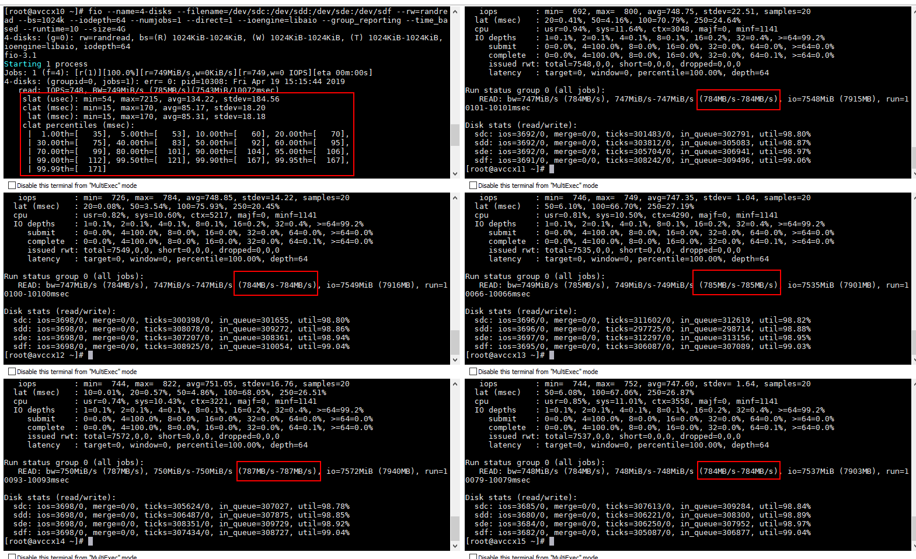

Use `fio` to validate mounted RAID0 XFS read and write throughput (`/dev/md0` is mounted as `/data`).

```
fio --name=raid0 --filename=/data/fio1 --rw=read --bs=1024k --iodepth=64 --numjobs=1 --direct=1 --ioengine=libaio --group_reporting --time_based --runtime=10 --size=4G

fio --name=raid0 --filename=/data/fio1 --rw=randread --bs=1024k --iodepth=64 --numjobs=1 --direct=1 --ioengine=libaio --group_reporting --time_based --runtime=10 --size=4G

fio --name=raid0 --filename=/data/fio1 --rw=write --bs=1024k --iodepth=64 --numjobs=1 --direct=1 --ioengine=libaio --group_reporting --time_based --runtime=10 --size=4G

fio --name=raid0 --filename=/data/fio1 --rw=randwrite --bs=1024k --iodepth=64 --numjobs=1 --direct=1 --ioengine=libaio --group_reporting --time_based --runtime=10 --size=4G
```

## Data Disk IOPS
Use `fio` to validate disk random read IOPS for all VMs to ensure it is ~20k as expected for `DS14_v2` with 4xP30 disks.

```
fio --name=4-disks --filename=/dev/sdc:/dev/sdd:/dev/sde:/dev/sdf --rw=randread --bs=4k --iodepth=64 --numjobs=1 --direct=1 --ioengine=libaio --group_reporting --time_based --runtime=10 --size=4G
```

> In the screenshot example below, something initially looks wrong with different IOPS across the 6 VMs. Latency numbers also appear to be different. If this rare behavior is noticed, try to "Redeploy" the VM from the portal so that it lands on another host, and then re-test again.

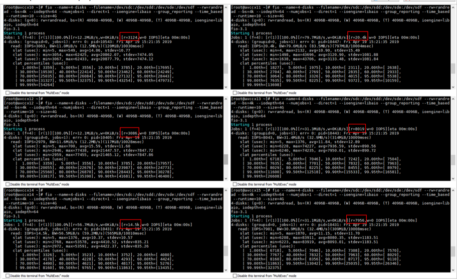

`iostat` output from one of the 6 VMs showing how IOPS are spread across the four disks when reading from the mdadm stripe set `/dev/md0`.

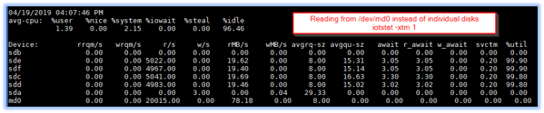

Cassandra mostly uses sequential write IO, but it is still insightful to confirm that random write IOPS are as expected on the `/data` mount point for `/dev/md0` stripe set. In this case, 4k write IOPS are ~19k on all VMs with average latency of ~3.3ms.

```
fio --name=raid0 --filename=/data/fio1 --rw=randwrite --bs=4k --iodepth=64 --numjobs=1 --direct=1 --ioengine=libaio --group_reporting --time_based --runtime=10 --size=4G
```
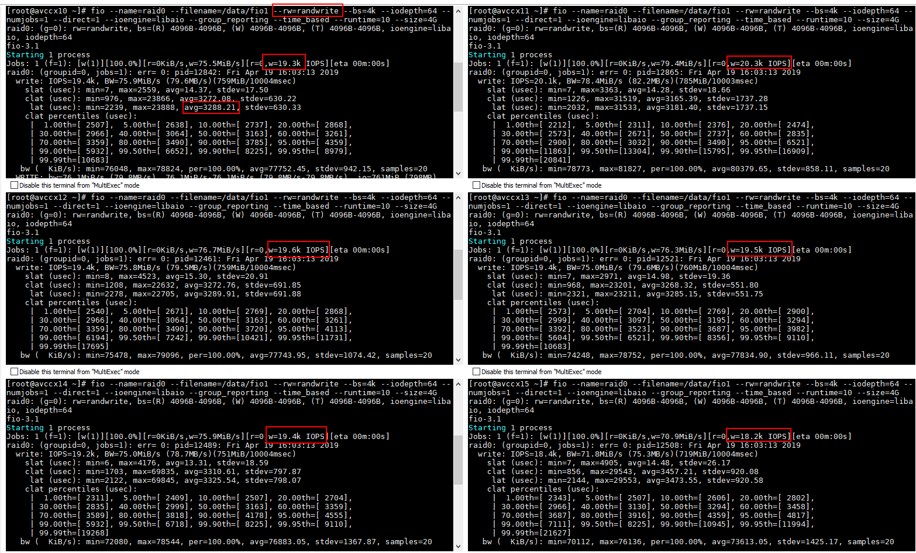

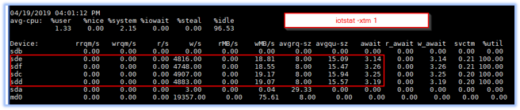

Use `fio` to validate mounted RAID0 XFS random read and write IOPS and latency (`/dev/md0` is mounted as `/data`).

```
fio --name=raid0 --filename=/data/fio1 --rw=randread --bs=4k --iodepth=64 --numjobs=1 --direct=1 --ioengine=libaio --group_reporting --time_based --runtime=10 --size=4G

fio --name=raid0 --filename=/data/fio1 --rw=randwrite --bs=4k --iodepth=64 --numjobs=1 --direct=1 --ioengine=libaio --group_reporting --time_based --runtime=10 
--size=4G

fio --name=raid0 --filename=/data/fio1 --rw=write --bs=4k --iodepth=64 --numjobs=1 --direct=1 --ioengine=libaio --group_reporting --time_based --runtime=10 --size=4G
```

## Local Disk Throughput
Since, in these experiments, we used local/ephemeral disk (220GB on `DS14_v2`) for commitlog (see [Test Setup](../README.md#test-setup) section),  `fio` is used for validating local disk write throughput (~530MB/s on `DS14_v2`) on all VMs. Read throughput should be similar.

```
fio --name=raid0 --filename=/mnt/resource/fio1 --rw=randwrite --bs=1024k --iodepth=64 --numjobs=1 --direct=1 --ioengine=libaio --group_reporting --time_based --runtime=10 --size=4G
```

Notice how local disk throughput is **lower** than the 4xP30 disks with disk caching disabled. This is expected.

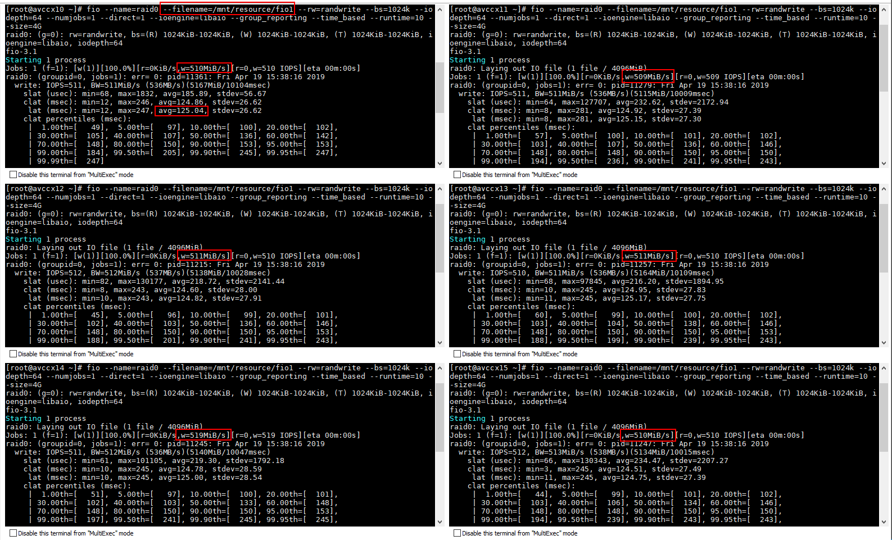

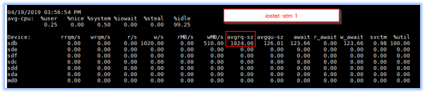

## Local Disk Latency
Cassandra write performance is partially dependent on the latency of the disk that is used to store the commitlogs. Use `fio` to validate local disk sequential and random write latency on all VMs. Read latency should be similar.

```
fio --name=raid0 --filename=/mnt/resource/fio1 --rw=randwrite --bs=4k --iodepth=64 --numjobs=1 --direct=1 --ioengine=libaio --group_reporting --time_based --runtime=10 --size=4G
```
Local disk IOPS are around ~50K and average latency is 1.1ms which is about 3x lower than the durable attached premium storage disks.

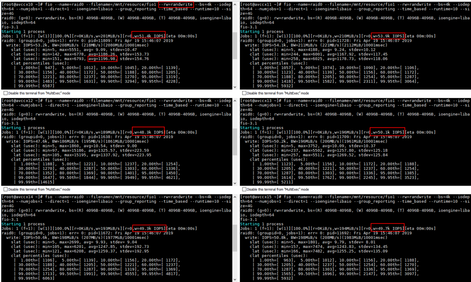

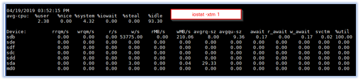

## Next

Return to [Learnings and Observations](../README.md#learnings-and-observations) table of contents


