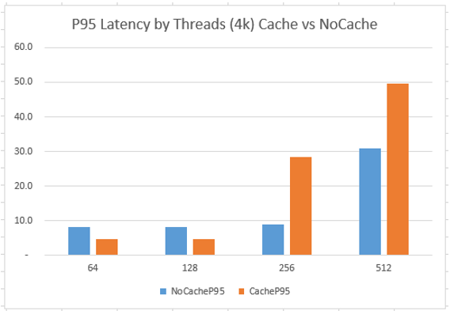

# Comparing Azure VM data disk caching configurations

Cassandra reads, which do not find data in memory, issue random disk I/O to look for relevant data in the SSTable files on disk (see [this](https://docs.datastax.com/en/archived/cassandra/3.0/cassandra/dml/dmlAboutReads.html) for more about Cassandra read path). This means performance of reads is directly influenced by read disk latency. 

Azure provides ability to turn on caching for data disks so that recently read data can be found "locally" within the host and does not need to be retrieved from remotely-attached Managed Premium Data Disks (see [this learning path](https://docs.microsoft.com/en-us/learn/modules/caching-and-performance-azure-storage-and-disks/))

When running with data disk caching set to "None" and after clearing page cache, Cassandra reads on Azure VMs are heavily influenced by remote disk latency (the tests here show about ~3.3ms, but it is an area that is being constantly improved in Azure). On the other hand, when disk caching is set to "ReadOnly" and the same data is being read multiple times, latency is much lower.

Since, for Cassandra workloads, customers are often looking for lowest-latency reads, `DiskCaching=ReadOnly` is usually the best option since it provides much lower latency for reads of the same data. 

## Disk Caching and Client Threads

The following graphs compare performance when reading 3 million out of 150 million 4KB documents, with `read_ahead_kb=64` and various client threads.

When thread count is lower, `CacheOpsSec` is higher. However, because throughput throttles for cached reads are lower than uncached reads (due to the way [Azure BlobCache works on the host](https://docs.microsoft.com/en-us/azure/virtual-machines/windows/premium-storage-performance#disk-caching)), there seems to be some tapering off of ops/sec as client threads are increased.

In the figure below, vertical axis is operations/second (higher is better) and horizontal axis is number of client threads used during the test.

P50 latency (in milliseconds on vertical axis) of cached reads is always lower, but P95 latency (shown on separate graph for clarity) of cached reads increases for higher client thread test runs because of lower overall throughput from the Premium Managed Disks with caching enabled (512MB/sec cached and 768MB/s uncached, see [this](https://docs.microsoft.com/en-us/azure/virtual-machines/linux/sizes-memory#dsv2-series-11-15)).

## Disk Caching and Read-ahead

The following graphs show an interesting interaction between read-ahead and disk caching when reading 3 million out of 150 million 4KB documents using 128 client threads.

When disk caching is enabled, lower read-ahead values drive higher ops/s, but when read-ahead is increased over 32kb, ops/s decreases below uncached performance due to lower cached throttles.

In the figure below, vertical axis is operations/second (higher is better) and horizontal axis is the read-ahead in KBs.

As expected, P50 latencies are lower for cached disks, but P95 latencies (shown on separate graph for clarity) increase sharply for cached disks when large read-ahead is used, likely due to BlobCache throttling.

In the figures below, vertical axis is latency in milliseconds (lower is better) and horizontal axis is the read-ahead in KBs.

The graph below shows that increasing the number of client threads drives higher ops/s for non-cached disks, but does not increase ops/s for cached disks since its latency is already lower and ops/s on a given number of threads is already higher. With higher thread counts, cached disks seem to perform "worse" due to lower cached throttles. 

In the figure below, vertical axis is operations/second (higher is better) and horizontal axis is the read-ahead size in KBs.

## Next

Return to [Learnings and Observations](../README.md#learnings-and-observations) table of contents