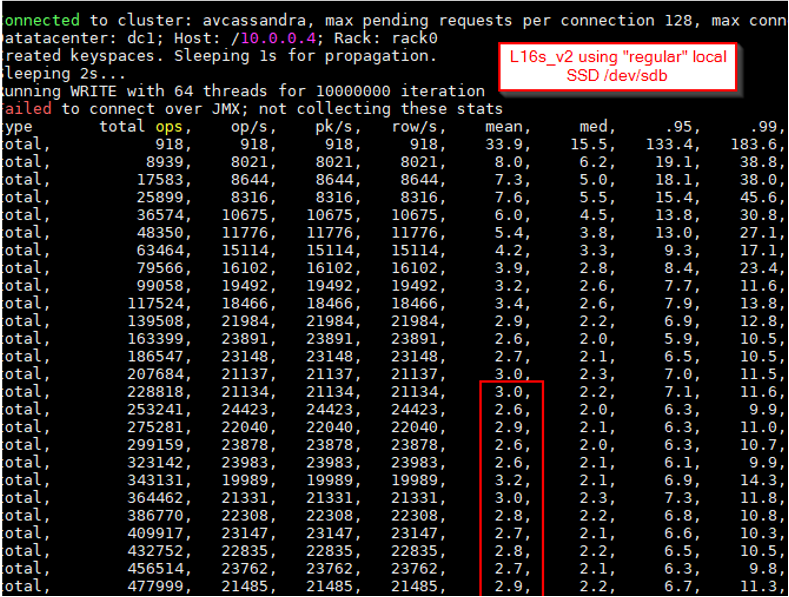
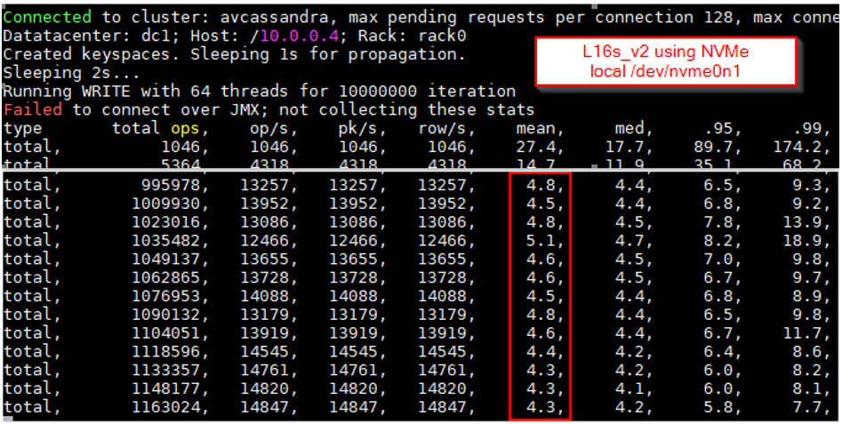
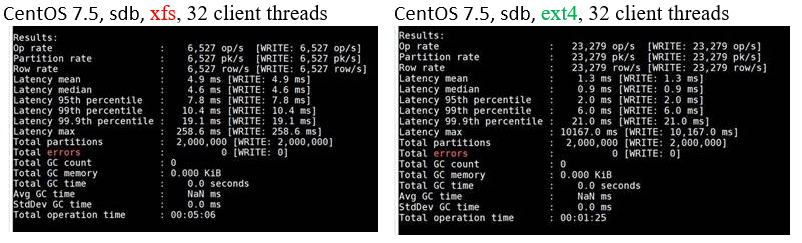
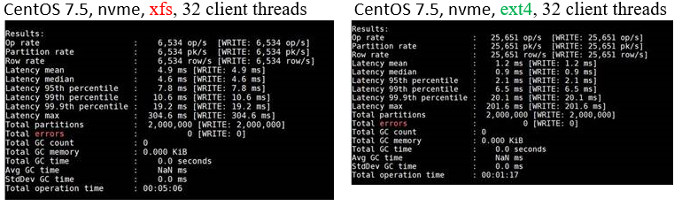
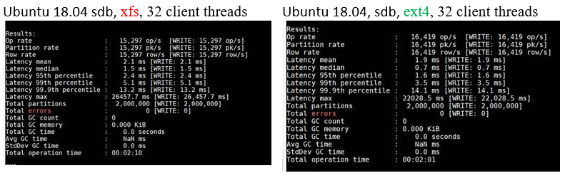
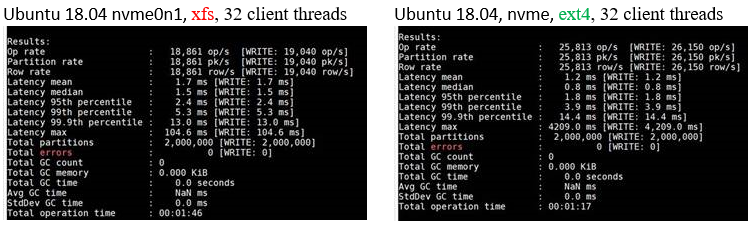
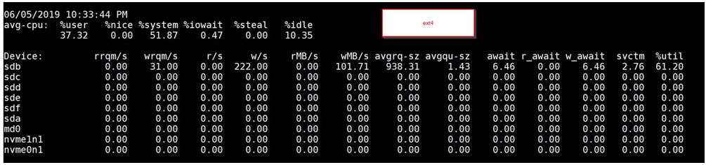
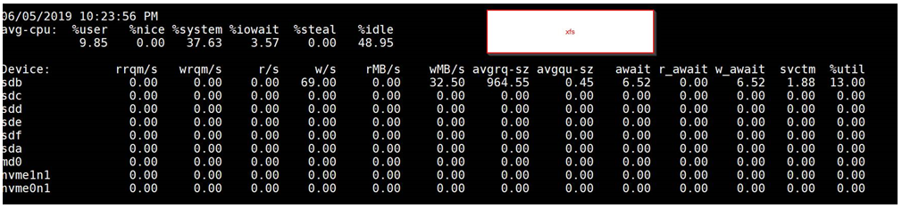
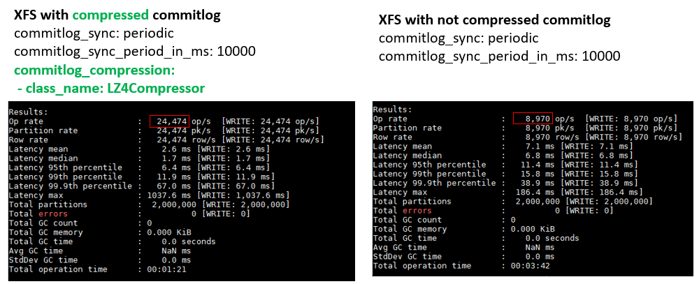
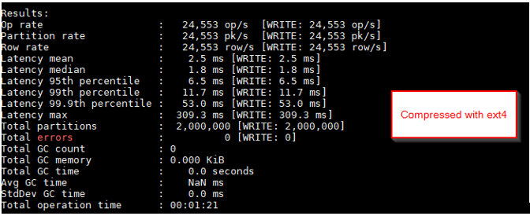

# Observations on ext4 and xfs filesystems and compressed commitlogs

One of the tests is designed to answer the question "What's the best Cassandra performance that can be achieved in Azure using a storage-optimized VM size and how it compares to performance when using `DS14_v2` VM with Premium Storage?"

## Ls_v2 NVMe test

[Azure Ls_v2 VMs](https://docs.microsoft.com/en-us/azure/virtual-machines/linux/storage-performance) have local NVMe disks that provide very low latency and high throughput. These types of VMs are often used for workloads that require "storage optimized" instances. Since NVMe disks are local in the host, they are ephemeral, and data stored on these disks is lost if the VM is migrated to another host. Therefore, using these disks for durable data storage requires a higher level of replication across VMs, or ability to reconstruct the data from persistent storage.

The expectation was that `L16s_v2` Azure VMs would provide good performance for both write and read Cassandra tests and would serve as an interesting point of comparison to the proven and productionized `DS14_v2` VM size.

However, surprisingly, the latency and operations/second that we **initially** saw when using the NVMe disk (`/dev/nvme0n1` mounted as `xfs`) for commitlog in `LS16s_v2` was worse than local SSD (`/dev/sdb`) in `DS14_v2`.

`cassandra-stress` screenshots below show how write latency and ops/s (using 64 client threads) are noticeably worse when using `/dev/nvme0n1` instead of `/dev/sdb` (even though synthetic tests and `blktrace` of the devices show that `nvme0n1` is significantly faster, as expected).

The figure below shows `cassandra-stress` output on `L16s_v2` using regular **local SSD `/dev/sdb`**, which is as usual mounted by `waagent` as `ext4` at `/mnt/resource` (mean latency is ~2ms and ops/s is ~21k):



The figure below shows `cassandra-stress` output on `L16s_v2` using **local NVMe `/dev/nvme0n1`** mounted as `xfs` (mean latency is higher at ~4ms vs. ~2ms and ops/s are lower at ~14k vs. ~21k):



After further investigation, a **key difference** was identified between the two tests: 
* Regular local SSD `/dev/sdb` was formatted and mounted as **`ext4`** filesystem (which is how `waagent` by default formats the `/dev/sdb` device in Azure VMs running CentOS)
* On the other hand, we formatted the local NVMe `/dev/nvme0n1` as **`xfs`** filesystem (which is the commonly used filesystem for Cassandra)

## ext4 vs xfs tests

We repeated the tests of `/dev/sdb` and `/dev/nvme0n1` using the same filesystem (`ext4` on each, and `xfs` on each) and saw that the write latency and ops/s degradation that we saw originally was **not** due to NVMe vs. SSD difference, but rather directly related to `ext4` vs. `xfs`. In other words, when running Cassandra on CentOS 7.5 with commitlog on `ext4` it seems to dramatically outperform `xfs` whether it is local SSD or NVMe device.

To gather more data, tests were performed on various versions of Cassandra on Azure and other cloud VMs running CentOS 7.x, which showed the same pronounced performance difference when commitlogs were on `ext4` (better) vs. `xfs` (worse). The difference was much less noticeable when running Cassandra on Ubuntu 18.04 instead of CentOS.

We tried both OpenJDK 1.8.0 and Oracle JDK 1.8.0 with Cassandra version 3.11.4 and others.

`cassandra.yaml` commitlog with default config:
```
commitlog_sync: periodic
 commitlog_sync_period_in_ms: 10000
 commitlog_segment_size_in_mb: 32
```

`cassandra-stress` test command:
```
cqlsh --execute "DROP KEYSPACE IF EXISTS keyspace1;" 10.0.0.4
cassandra-stress write no-warmup n=2000000 cl=LOCAL_QUORUM \
-rate threads=32 throttle=0/s \
-pop seq="1..10000000" -col size=FIXED\(818\) \
-node "10.0.0.4" \
-schema keyspace=keyspace1 \
-log interval=1 -mode native cql3 connectionsPerHost=128
```

`ext4` mount looked like this:
```
/dev/sdb1 on /mnt/resource type ext4 (rw,relatime,seclabel,data=ordered)
```

`xfs` mount looked like this:
```
/dev/sdb1 on /mnt/resource type xfs (rw,relatime,seclabel,attr2,inode64,noquota)
```

### CentOS 7.5 ext4 vs xfs

The `cassandra-stress` screenshots below show that, for CentOS 7.5, either `/dev/sdb` or `/dev/nvme0n1` both perform worse for writes when commitlog is on `xfs` filesystem.





### Ubuntu 18.04 ext4 vs xfs

The `cassandra-stress` screenshots below show that, for Ubuntu 18.04, the difference between `ext4` and `xfs` is less pronounced.





### iostat output ext4 vs xfs

Screenshots below show how `iostat -xtm` output looked like for **`/dev/sdb`** with `ext4` and `xfs`. The primary difference seemed to be the higher queue depth (avqu-sz) and write merges (wrqm/s) in ext4.





## XFS and compressed versus regular commitlog

Further tests showed that, when using Cassandra commitlog compression, the performance of `xfs` and `ext4` is equivalent and good (even on CentOS).

The key difference is that Cassandra's write code-path in the non-compressed scenario is using [MappedByteBuffer](https://github.com/apache/cassandra/blob/cassandra-3.11/src/java/org/apache/cassandra/db/commitlog/MemoryMappedSegment.java) (i.e. memory mapped file) while [compressed code-path](https://github.com/apache/cassandra/blob/cassandra-3.11/src/java/org/apache/cassandra/db/commitlog/CompressedSegment.java) is using regular FileChannel and ByteBuffer.



Compressed `xfs` performs as well as compressed and non-compressed `ext4`. For example, the screenshot below shows 24K ops/s for compressed `ext4` which is comparable to the 24K above for `xfs`.



## Conclusion

The reason behind non-compressed **xfs** commitlog performance being worse on CentOS (i.e. potentially some difference in how Java MemoryByteBuffer works on CentOS XFS and/or kernel) is still unknown.

For now, when placing commitlogs on an `xfs` filesystem, **turning on commitlog compression** is a viable approach since it brings **`xfs`** performance inline with `ext4`.

## Next

Return to [Learnings and Observations](../README.md#learnings-and-observations) table of contents