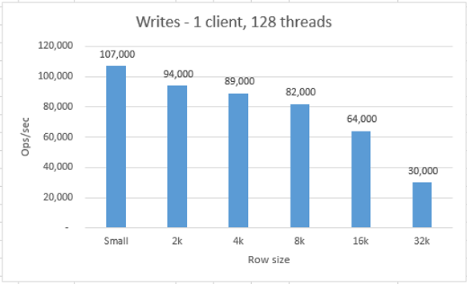
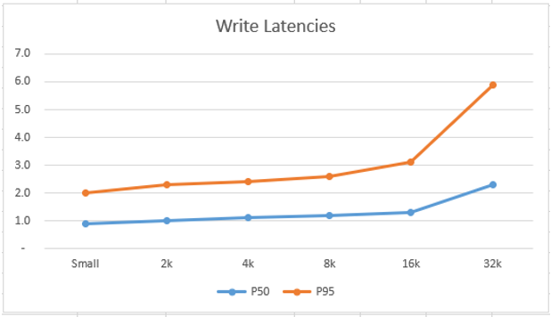
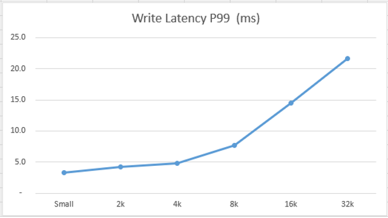
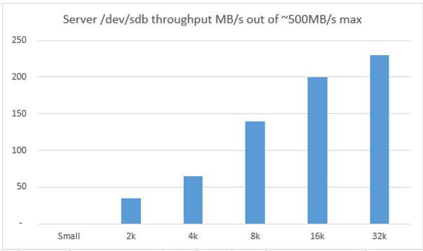
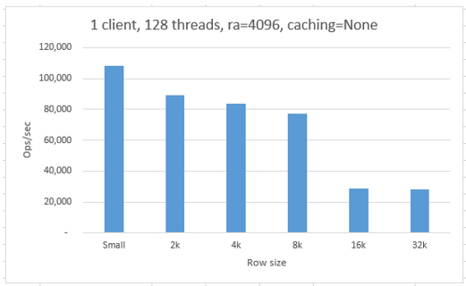
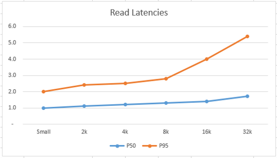
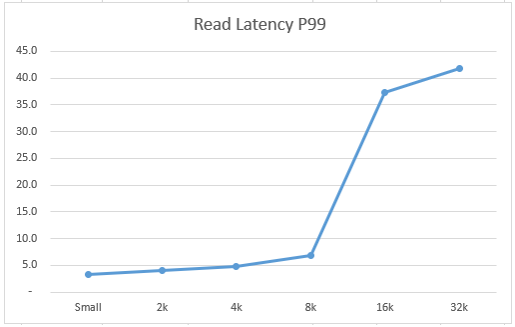
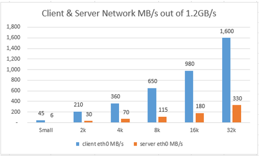

# Comparing relative performance of various Cassandra document sizes

When running the `cassandra-stress` tool without specific table/column definitions, it by default creates a table with a 10-byte key column and five 34-byte blob columns (`C0`,`C1`,`C2`,`C3`,`C4`). This means that the default `cassandra-stress` "document size" is 180 bytes (10+34*5).

Since most applications use larger document sizes, it is informative to compare the relative write/read performance of various common sizes to get an intuitive feel for how operations/second and latencies change as document sizes are increased.

The graphs below are based on performance of a 6x`DS14_v2` cluster with commitlog on the local/temporary SSD disk and data files on striped set of 4xP30 disks, with 1 `DS14_v2` client VM running `cassandra-stress` with 128 threads. The absolute numbers for ops/s and latency would change, with a higher or lower number of threads or more clients. However, the objective was to get an idea for the relative performance difference between various document sizes.

## Writes by document size

The following simple `cassandra-stress` command was used for executing the tests and varied the `-col size=FIXED(...)` parameter to generate columns of various sizes: 2k=409 * 5, 4k=818 * 5, 8k=1636 * 5, 16k=3272 * 5, and 32k=6544 * 5

```
# 4kb write example
cassandra-stress write no-warmup n=10000000 cl=LOCAL_QUORUM \
-rate threads=128 throttle=0/s \
-pop seq="1..20000000" -col size=FIXED\(818\) \
-node "10.0.0.4,10.0.0.5,10.0.0.6,10.0.0.7,10.0.0.8,10.0.0.9" \
-schema keyspace=keyspace4k \
-log interval=1 -mode native cql3 connectionsPerHost=128
```

As expected, ops/sec decreased when the document size is increased ("Small" is the default 180-byte document size).



The following two graphs show how P50, P95, and P99 latencies (vertical axis in milliseconds, lower is better) increase gradually with document size (horizontal axis). P99 latency is shown separately to make it easier to see the smaller increase in P50 and P95.





Since this experiment has commitlogs on the local/temporary SSD disk, it is interesting to look at the `/dev/sdb` throughput to confirm that it is not yet hitting the throughput throttle of 500MB/s for `DS14_v2` local SSD. 

Vertical axis shows the throughput in MB/s and horizontal axis shows the document size.



## Reads by document size

After data is generated by the `cassandra-stress` write step, read tests are executed, to see if the relative pattern is similar. 

The following `cassandra-stress` command executes the read tests from keyspaces previously generated with the correct column sizes during write tests.

```
# 4KB read example
cassandra-stress read no-warmup n=10000000 cl=LOCAL_QUORUM \
-rate threads=128 throttle=0/s \
-pop seq="1..20000000" -col size=FIXED\(818\) \
-node "10.0.0.4,10.0.0.5,10.0.0.6,10.0.0.7,10.0.0.8,10.0.0.9" \
-schema keyspace=keyspace4 \
-log interval=1 -mode native cql3 connectionsPerHost=128
```

This test used the default suboptimal `read_ahead_kb=4096` (see [this](cassandra-read-ahead.md) for more info about read ahead), `mdadm chunk size=64k`, and Azure `DiskCaching=None`. The page cache is not cleared, and it uses sequential keys (i.e. `-pop seq="1..20000000"`). The results would be slightly different if a random uniform distribution was instead used (`-pop disk=uniform("1..10000000")`) and the page cache was cleared, but this provides relative comparison between document sizes. 



The following two graphs shows how P50, P95, and P99 latencies (vertical axis in milliseconds, lower is better) increase gradually with document size (horizontal axis), while P99 (shown on separate graph for clarity) increases faster, likely due to hitting client networking limits for larger documents.





During reads, the client VM is pulling in data from 6 Cassandra nodes, so it is interesting to look at the network utilization on the client and each of the server nodes to confirm that client limits are not being reached. 

In the figure below, the document size is on the horizontal axis and throughput in MB/s is on the vertical axis. The orange bars represent approximate *egress* throughput from one of the 6 Cassandra servers, while client *ingress* throughput is the sum of data it receives from all 6 servers. Because Azure does not enforce hard throttle limits on *ingress* traffic based on VM size, client reach about 12Gbps ingress for large document sizes.




## Next

Return to [Learnings and Observations](../README.md#learnings-and-observations) table of contents