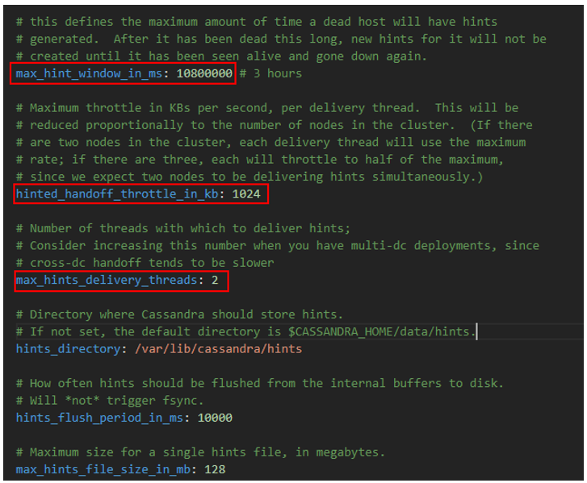
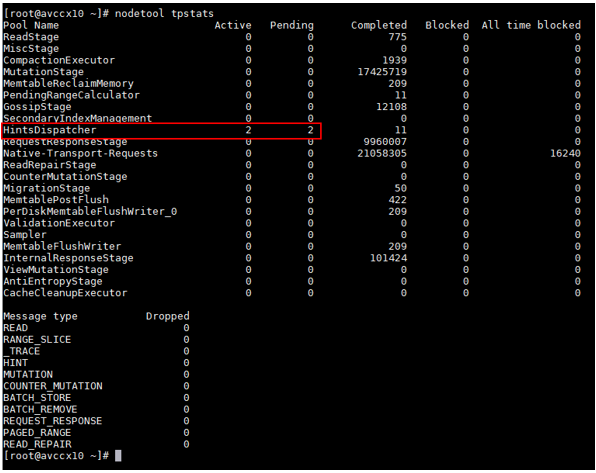
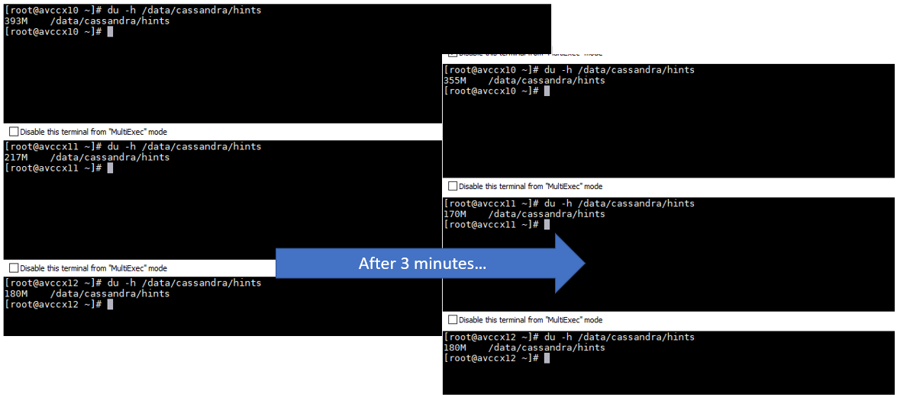

# Observations on hinted handoff in cross-region replication

During [multi-DC inter-region testing](cassandra-multi-dc-azure-regions.md), we observed that multi-region replication needs time to catch up.

When running heavy writes on nodes in DC1 which are replicating to nodes in DC2 with CL=LOCAL_QUORUM, not all of the data makes it into DC2 due to latency and load. Because the data is not yet there, when trying to read data from DC2 nodes using CL=LOCAL_QUORUM cassandra-stress tool returns "bad data" errors.

The cause of this behavior are writes/mutations that were too slow (i.e. over write_request_timeout_in_ms) from coordinator node in DC1 to nodes in DC2. These slow mutations get dropped (check **nodetool tablestats** for "Dropped Mutations") and stored as "hints" in a file directory on the coordinator node in DC1.

Example of a dropped mutation message in Cassandra's system.log file

```
INFO  [ScheduledTasks:1] 2019-05-14 23:06:05,040 MessagingService.java:1236 - MUTATION messages were dropped in last 5000 ms: 0 internal and 22062 cross node. Mean internal dropped latency: 0 ms and Mean cross-node dropped latency: 2500 ms
```

By default, hinted handoff is throttled to 2 threads and 1024kb across all nodes with maximum TTL of about 3 hours. To speed up time it takes for the hints to reach the other region, we needed to **increase** hinted_handoff_throttle_in_kb and max_hint_delivery_threads in cassandra.yaml. 

See http://www.uberobert.com/bandwidth-cassandra-hinted-handoff/ for examples of estimating reasonable values and experiment to see which values increase usage of available bandwidth without affecting normal performance. In other words, we want to see "net send/recv" sufficiently high to quickly process the hints and catch up.

Default cassandra.yaml hinted handoff configuration



**nodetool tpstats** shows hints dispatcher threads set to 2



Under heavy loads, dropped writes in DC1 when DC2=3 produce hints on the coordinator nodes and those hints need time to flow through to DC2



## Next

Return to [Learnings and Observations](../README.md#learnings-and-observations) table of contents