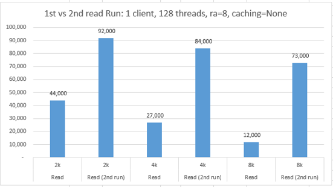
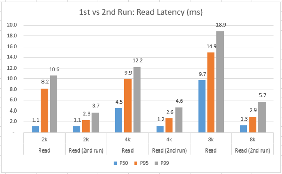
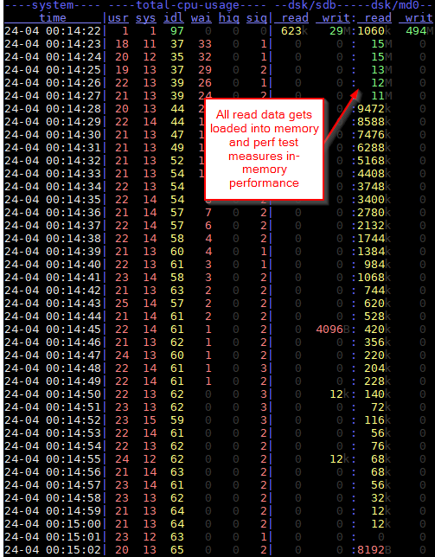
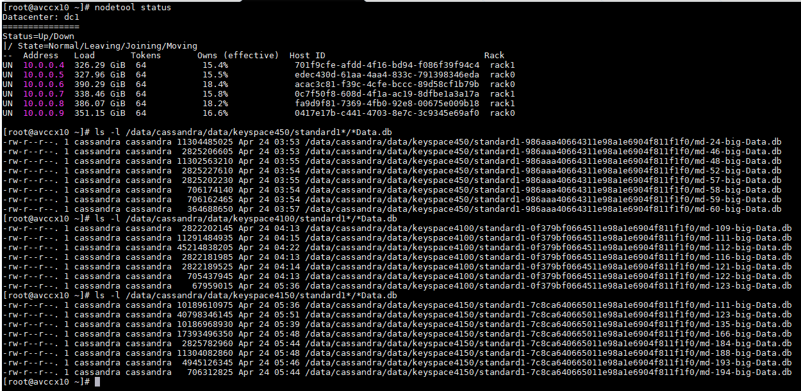

# Observations on Cassandra usage of Linux page caching

Cassandra stores data on disks in regular files and folders of the filesystem. Cassandra maintains separate folders per table and stores its data in SSTable format consisting of multiple files per table. Depending on compaction strategy, some of the SSTable files can be relatively large.

When reading its files, Cassandra's Java code is using regular file I/O and benefits from Linux page cache via Java's memory map feature. This means that after parts of the file are read one time, the read content is stored in the OS page cache, thereby causing subsequent read access to the same data to be much faster.

This means that when executing Cassandra read performance tests against the same data, the second and subsequent reads will **appear to be** much faster than the original read which needed to access data on the remote data disk.

Therefore, to get similar performance measurements on subsequent runs and to be able to compare differences between various tuning options (e.g. chuck size), it is necessary to clear the Linux page cache **and** restart Cassandra service to clear its internal memory.

In our tests, we used the following to clear the page cache and restart Cassandra service between most read tests, unless we specifically wanted to see differences between the first and second test executions.

```
# Stop Cassandra service
service cassandra stop

# Clear page cache, dentries, and inodes
free; sync; echo 3 > /proc/sys/vm/drop_caches; free

# Start Cassandra service
service cassandra start
```

## Comparing read test 1st and 2nd run

The screenshots below show how much difference there is between operations/second and latency observed during the 1st "cold" run and the subsequent 2nd run when data is already in Linux page cache and in Cassandra memory.

Config: 1 client, 128 threads, **pop=seq**, read_ahead_kb=8, Disk Caching=None, mdadm chunk size=64k, doc sizes 2k, 4k, 8k on x-axis

These cassandra-stress runs are using -pop seq, so 2nd run is more performant because data is already found in page cache.

In the two figures below, the vertical axis is operations/second (higher is better) and latency in milliseconds (lower is better), and horizontal axis is document size (2k, 4k, 8k) and 1st or 2nd run.




## Cassandra reads load data into memory and serve from there

When running cassandra-stress using "uniform" distribution, even after restarting Cassandra service and clearing Linux page cache, data quickly gets loaded into memory and read test performance maybe measuring memory-only reads. 

Screenshot of dstat output below shows how disk reads decrease after a few seconds as Cassandra loads more data into memory.
```
dstat -tam -N eth0 -D /dev/sdb,/dev/md0
```



* To get more static and repeatable disk perf numbers, we need to run using data set that does not fully fit into memory, but DS14_v2 VM size has a lot of RAM and would require a large table that takes long to generate.
* Instead we tried to create a synthetic test case that we could re-use for quicker test iterations:
    * Write table containing 150 million of 4K rows
    * Run 3M read tests against this table using "-pop disk=uniform()" from the full 150M keys
* Since probability of having key in the cache already is relatively small (3/150), this provides a good chance of actually reading the data from disk

### 4k write (150M records)
```
cassandra-stress write no-warmup n=150000000 cl=LOCAL_QUORUM \
-rate threads=256 throttle=0/s \
-pop seq="1..150000000" -col size=FIXED\(818\) \
-node "10.0.0.4,10.0.0.5,10.0.0.6,10.0.0.7,10.0.0.8,10.0.0.9" \
-schema keyspace=keyspace4150 \
-log interval=1 -mode native cql3 connectionsPerHost=128
```

### 4k read uniform (3M out of 150M records)
```
cassandra-stress read no-warmup n=3000000 cl=LOCAL_QUORUM \
-rate threads=128 throttle=0/s \
-pop dist=uniform\("1..150000000"\) -col size=FIXED\(818\) \
-node "10.0.0.4,10.0.0.5,10.0.0.6,10.0.0.7,10.0.0.8,10.0.0.9" \
-schema keyspace=keyspace4150 \
-log interval=1 -mode native cql3 connectionsPerHost=128
```

## Cassandra compaction and number of files

When data is not yet in memory, Cassandra will read from relevant SSTables, and the more SSTables there are, the higher chance of multiple separate reads and higher latency. Therefore, during perf testing, it is a good to look at approximately how many files are in a specific keyspace in the table to know if two read tests are comparable.



## Next

Return to [Learnings and Observations](../README.md#learnings-and-observations) table of contents
