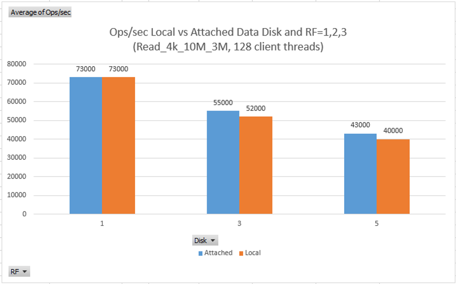

# Comparing performance of Azure local/ephemeral vs attached/persistent disks

Cassandra performance is usually impacted by disk latency. Therefore, some of the common questions when running Cassandra on Azure VMs are: What is the performance difference when using local/ephemeral vs. attached/premium data disks? In other words, should data directory be on local disks to improve reads? On the other hand, the downside of storing data on local disks is that this data will be lost if the host on which the VM is running fails and VM needs to be migrated to another host or the VM is stopped/deallocated and restarted since it will likely start on a different physical host.

To gain more insight into the relative performance between storing data on local/ephemeral vs. attach data disks, we ran the following tests.

## Write Performance on Local vs Attached Data Disks

In the following test, commitlog is also on the local disk with the default setting of commitlog_sync=periodic and commitlog_sync_period_in_ms=10000. In this configuration, Cassandra syncs/flushes data from memory to commitlog file every ~10 seconds and is not touching the disk for every write. Therefore, performance of writes with commitlog on premium attach disk versus on local/ephemeral disk would be almost identical for this configuration and more durable since commitlogs wouldn't be lost if VM gets migrated to another host. The reason we kept the commitlog on ephemeral disk in all of our tests was because it matched a specific customer scenario.

Writes go to memory first and are then flushed to commitlog on the ephemeral local disk. The data files (i.e. SSTables) are mostly touched during compaction. 

Based on the results in the graphs below, the ops/s and latency are the same whether the data files are on the ephemeral or attached disks with DiskCaching=ReadOnly because even during compaction performance of the attached disks with caching enabled it is gated by the throughput performance of the local disk that stores that cache.

In the two figures below, vertical axis is operations/second (higher is better) or latency in milliseconds (lower is better) and horizontal axis is the Replication Factor RF 1 or 3.

## Read Performance on Local vs Attached Data Disks

Based on the graphs below, initially we were a bit surprised that there was no noticeable difference between read ops/s when using local disk versus attached disks with DiskCaching=ReadOnly on DS14_v2 VM. One would expect that due to the much lower latency on the local disk, at least the latency results should be different.

Explanation of the observed behavior: This happens because during "write" test, the data blocks are written through to the **host** cache, and when read test is subsequently run (even after restarting Cassandra service and flushing Linux caches) it is finding the data in the host cache which is stored on the same local SSD used for the VM ephemeral disk. This means that for **data sets that fit in host cache**, when DiskCaching=ReadOnly is enabled, recent writes will be readable from attached disks with the same performance as if they were stored on local disk. However, if data set being read does not fit in host cache (e.g. 576GB on DS14_v2), reading from attached disks will have higher latency similar to DiskCaching=None scenario described [here](cassandra-azure-vm-disk-caching.md).

In the two figures below, vertical axis is operations/second (higher is better) or latency in milliseconds (lower is better) and horizontal axis is the Replication Factor RF 1, 3, and 5.

## Mixed 50/50 Read/Write Performance on Local vs Attached Data Disks

Mixed 50% read / 50% write results look analogous to the read results above. Because read test is touching data that was recently written by the write test, there is no noticeable difference between the local and attached disks. However, for workloads that read older data that is not in the host cache anymore, or read data that's larger than the host cache, the difference between local and attached disk performance will be similar to the DiskCaching=None vs ReadOnly described [here](cassandra-azure-vm-disk-caching.md).

In the two figures below, vertical axis is operations/second (higher is better) or latency in milliseconds (lower is better) and horizontal axis is the Replication Factor RF 1, 3, and 5.

## Next

Return to [Learnings and Observations](../README.md#learnings-and-observations) table of contents