# Measuring impact of mdadm chunk sizes on Cassandra performance

When running Cassandra on Azure, it is common to create an mdadm stripe set (RAID 0) of multiple data disks to increase the overall disk throughput and IOPS closer to the VM limits. For example, one P30 (1TB) disk can drive 200MB/second of throughput and 5000 IOPS, while Standard_DS14_v2 VM can provide up to 512MB/second of cached throughput and 64000 of cached IOPS.

Optimal disk stripe size is an application specific setting. For example, for SQL Server OLTP workload the recommendation is 64KB, while for data warehousing workloads it is 256KB (see [here](https://docs.microsoft.com/en-us/azure/virtual-machines/windows/sql/virtual-machines-windows-sql-performance#data-disks))

When creating the stripe set for Cassandra, frequent question is **"What is the chunk/stripe size that I use for best Cassandra performance?"**.

To answer this question, we looked at performance impact of a few different chunk sizes running cassandra-stress tests reading 3M out of 150M 4k documents (which is about 100GB on each of the 6xDS14_v2 nodes with 4xP30 disks).

Comparing various Disk Caching configurations:
* None
* ReadOnly-Full: where host cache is full since reads are happening after performing the writes to create the 150M table
* ReadOnly-Empty: where host cache is empty (invalidated by turning disk caching off and then back on and rebooting the VM)

Comparing a few specific chuck sizes:
* 4k (even before the test, it was obvious that this is not a reasonable chunk size to use since it is too small, but it was tested for comparison)
* 64k
* 128k
* 256k

Example of how to check current chunk size being used by mdadm array.

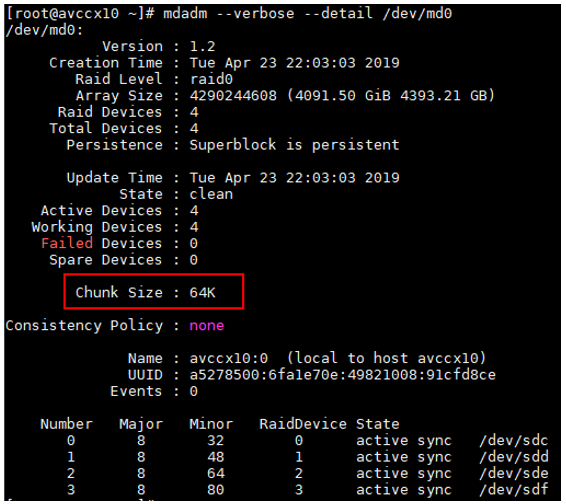

Note that to change the chunk size of an mdadm RAID 0 stripe set, the array needs to be recreated and all data needs to be reloaded.
```
# WARNING!!! Destructive operation!
umount /dev/md0
mdadm --stop /dev/md0
mdadm --zero-superblock /dev/sdc /dev/sdd /dev/sde /dev/sdf
```

```
# Create mdadm stripe set (RAID 0) with chunk size ZZZ
mdadm --verbose --create /dev/md0 --metadata=1.2 --chunk=ZZZ --level=raid0 --raid-devices=4 /dev/sd[cdef]
mdadm --verbose --detail --scan > /etc/mdadm.conf
mdadm --verbose --detail /dev/md0
```

## Conclusion

From our tests, there does not seem to be material difference between chunk sizes of 64k, 128k, and 256k for Cassandra reads irrespective of caching configuration.

It is clear that 4k chunk size is not a good option. It was tested just for reference.

From the following graphs, there could be a small benefit to the 128k size, but only slightly noticeable. Therefore, if one is already using a chunk size of 64k or 256k, it would likely not make sense to go through rebuilding array to use 128k size. However, if one is starting fresh, it may make sense to use the 128k size from the beginning.

## Chunk sizes with DiskCaching=ReadOnly-Full

ReadOnly-Full means that the reads are happening after recently performed writes, so the host cache contains the data and the ops/s are high and latency is low. Note that even in this fully-cached case, 4k chunk size performance is worse than other sizes.

In the figure below, vertical axis is operations/second (higher is better) and horizontal axis is the number of client threads used during the read test. Each of the four separate lines on the graph represents different chunk size. As number of threads is increased, ops/s begin to taper off as VM reaches it disk throughput limits.

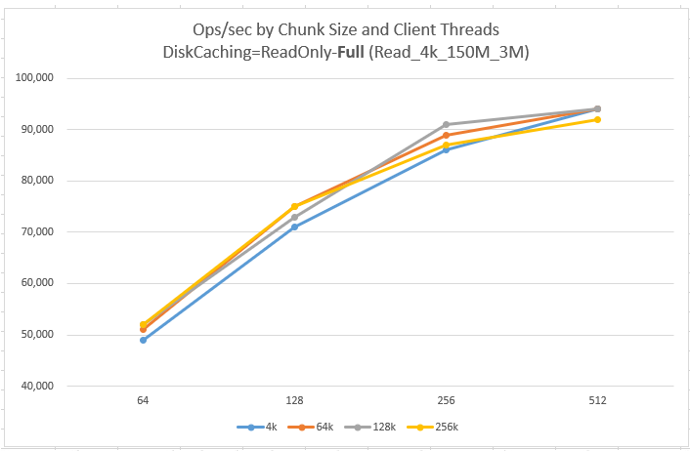

In the three figures below, vertical axis is latency in milliseconds (lower is better) and horizontal axis is the number of client threads. Percentile 50, 95, and 99 latencies are shown on separate graphs to make them easier to read for various chunk sizes.

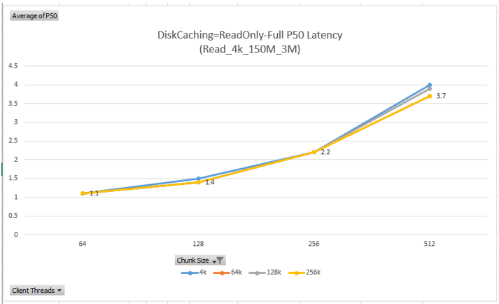

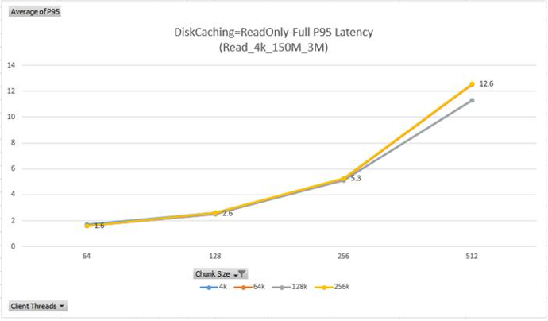

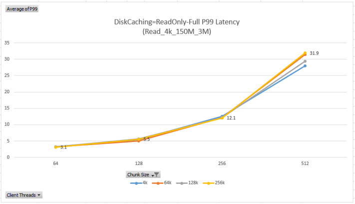

## Chunk sizes with DiskCaching=ReadOnly-Empty

ReadOnly-Empty means that even though DiskCaching=ReadOnly, the host cache is empty and does not contain recently written data (we invalidated the host cache by setting DiskCaching=None and then back to ReadOnly and restarting the VM). 

Note that the higher client thread counts (256 and 512) show much higher Ops/sec since as the test is running the host cache is filling in so subsequent runs perform faster.

In the figure below, vertical axis is operations/second (higher is better) and horizontal axis is the number of client threads used during the read test. Each of the four separate lines on the graph represents different chunk size.

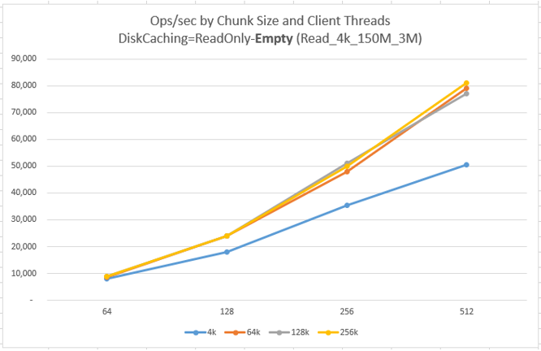

For ReadOnly-Empty scenario, latency appears to improve with higher client thread counts. However, this is because subsequent runs with higher client thread counts are benefiting from the cached data from the previous runs.

In the three figures below, vertical axis is latency in milliseconds (lower is better) and horizontal axis is the number of client threads. Percentile 50, 95, and 99 latencies are shown on separate graphs to make them easier to read for various chunk sizes.

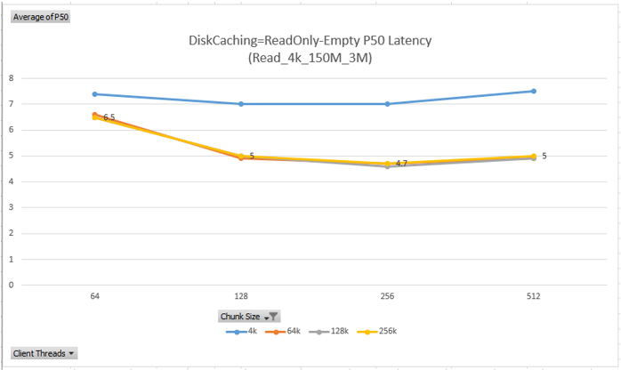

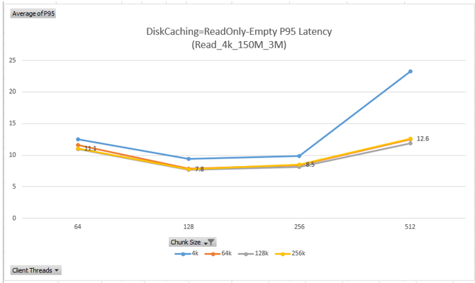

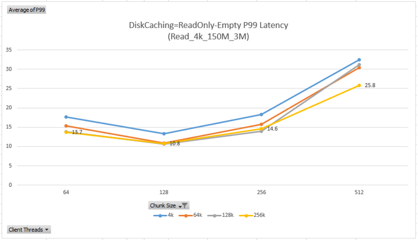

## Chuck sizes and "Full" versus "Empty" cache

Graphs below show an interesting way to look at the difference between **Full** cache (top two lines) and **Empty** cache (bottom two lines).

The ops/s is appearing to increase dramatically for the **Empty** cache scenario because subsequent runs benefit from data being cached during previous runs.

In the figure below, vertical axis is operations/second (higher is better) and horizontal axis is the number of client threads used during the read test. The lines in the graph compare only two chunk sizes 128k and 256k for Full and Empty cache (i.e. total of 4 lines).

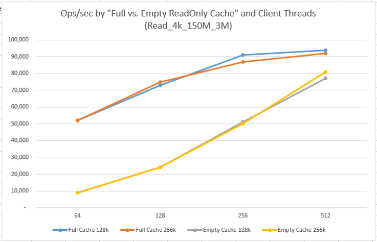

In the three figures below, vertical axis is latency in milliseconds (lower is better) and horizontal axis is the number of client threads. Percentile 50, 95, and 99 latencies are shown on separate graphs to make them easier to read for various chunk sizes (128k, 256k) and caching (Full, Empty).

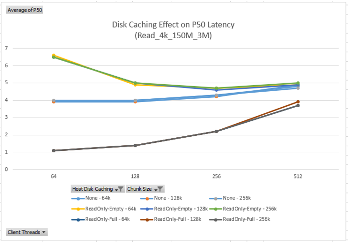

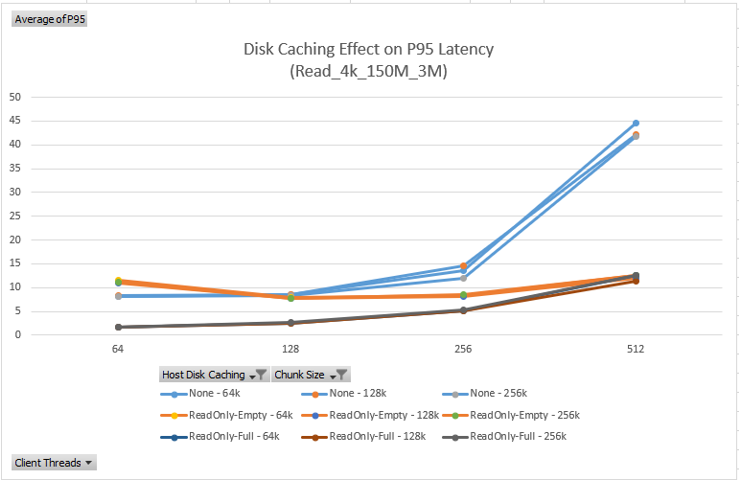

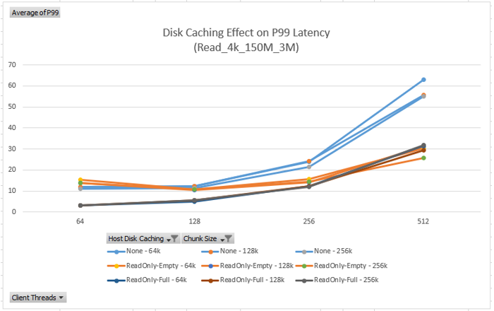

## Chuck sizes ReadOnly-Empty "RunA" versus "RunB"

Graphs below show a more direct comparison between two runs for the ReadOnly-Empty cache:
* RunA (1st run) are the bottom two lines
* RunB (2nd run) are the top two lines

RunB shows higher ops/s because more data is in the host cache by this point since it got filled there during RunA.

In the figure below, vertical axis is operations/second (higher is better) and horizontal axis is the number of client threads used during the read test. The lines in the graph compare only two chunk sizes 128k and 256k and RunA and RunB (i.e. total of 4 lines).

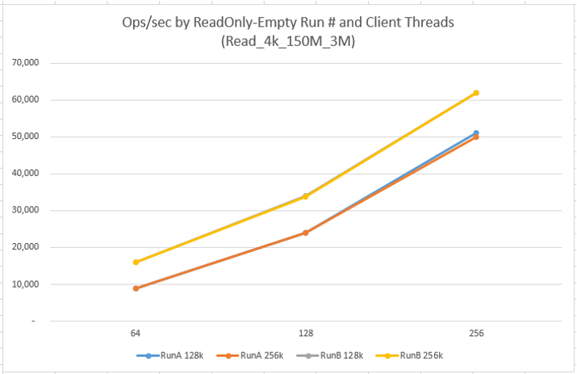

In the three figures below, vertical axis is latency in milliseconds (lower is better) and horizontal axis is the number of client threads. Percentile 50, 95, and 99 latencies are shown on separate graphs to make them easier to read for various chunk sizes (128k, 256k) and runs (RunA, RunB).

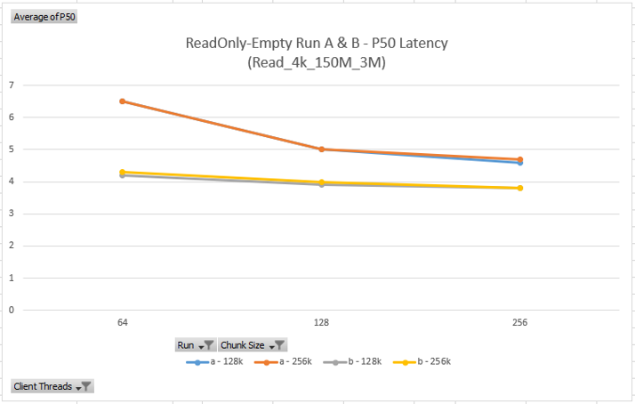

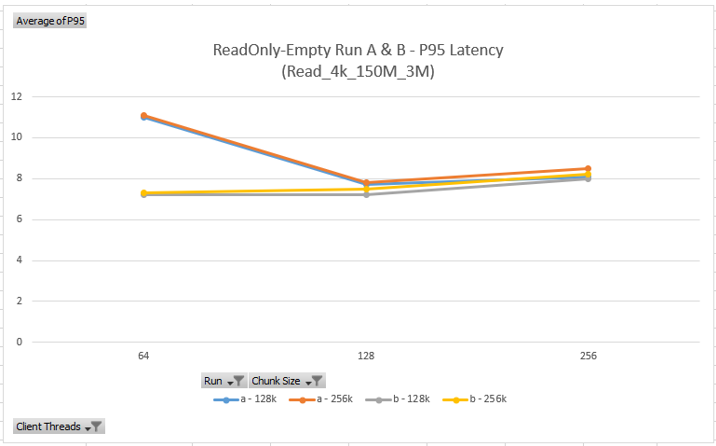

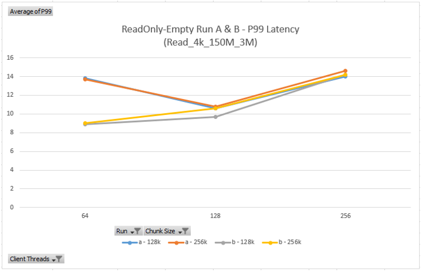

## Next

Return to [Learnings and Observations](../README.md#learnings-and-observations) table of contents