# Measuring impact of multi-DC cross-region replication

Cassandra natively supports the concept of multiple data centers (DC) making it easy to configure one Cassandra ring across multiple regions or as separate "virtual DC" (e.g. one for analytics and one for write heavy workloads) in the same physical location. 

One might assume that the performance of Cassandra in a multi-DC configuration would grow linearly. For example, if one can do 100k writes/sec against one DC, one might expect to be able to do 200k writes/sec against two DCs that are replicating to each. However, this is not feasible since bandwidth and CPU/disk resources need to be spent on receiving/sending inter-region replication traffic.

We ran the following tests to see how Cassandra ops/s and latency changes in a multi-DC Cassandra deployment show in the following diagram. 6-nodes are in South Central US with replication to 6-nodes in East US 2 with LOCAL_QUORUM consistency level.

## Multi-DC setup

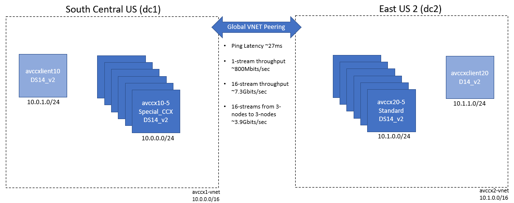

This is how **nodetool status** output looked like prior to loading data into the multi-dc ring

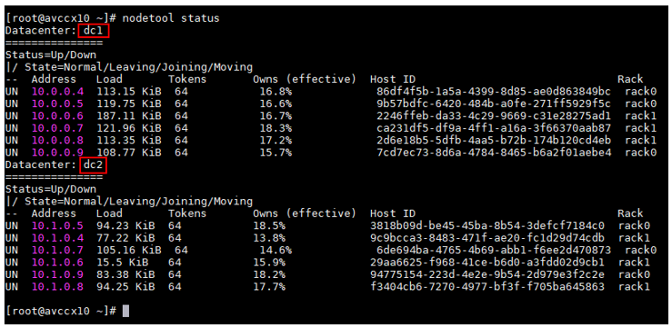

## Inter-region network performance

First, we tested network performance between VMs in separate regions connected via [Azure Global VNet-peering](https://docs.microsoft.com/en-us/azure/virtual-network/virtual-network-peering-overview):

* 1 DS14_v2 VM in East US 2
* 1 DS14_v2 VM in South Central US 

Roundtrip ping latency was around 27ms

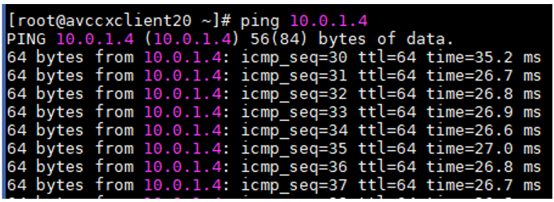

Single-stream throughput measured by iperf3 was around 830MBits/sec:

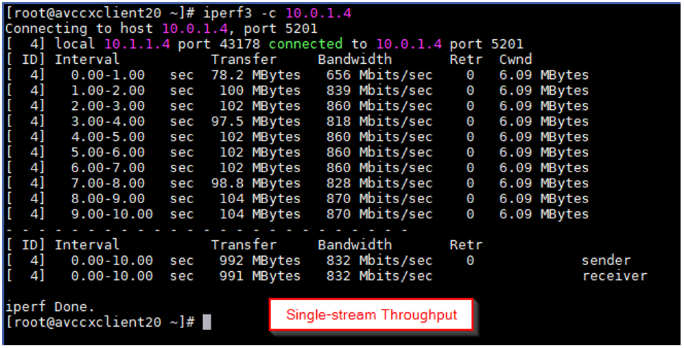

16-stream throughput measured by iperf3 was around ~7Gbps:

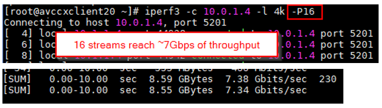

We also tested inter-region network throughput between 3 nodes in East US 2 and 3 nodes in South Central US over the same Azure Global VNet-peering and saw approximately 3-4Gbps of throughput per VM:

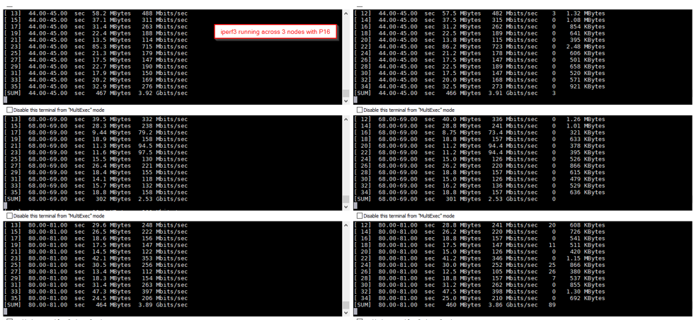

## Independent writes (RF=1) to each DC from its own client

We tested the baseline highest write performance by doing independent writes into each of the DCs from its own client located in the same region. The maximum writes for 256 and 128 threads are shown within the green arrows.

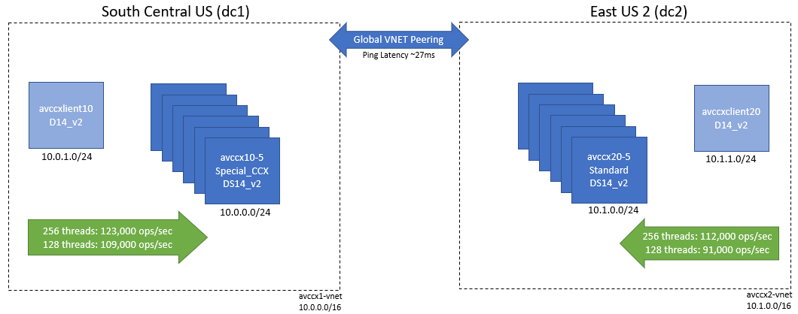

Sample cassandra-stress commands used in each of the DCs to write to its own keyspace

```
# 4k write (dc1=1)
cassandra-stress write no-warmup n=10000000 cl=LOCAL_QUORUM \
-rate threads=128 throttle=0/s \
-pop seq="1..10000000" -col size=FIXED\(818\) \
-node "10.0.0.4,10.0.0.5,10.0.0.6,10.0.0.7,10.0.0.8,10.0.0.9" \
-schema keyspace=ks410dc1rf1 "replication(strategy=NetworkTopologyStrategy, dc1=1)" \
-log interval=1 -mode native cql3 connectionsPerHost=128

# 4k write (dc2=1)
cassandra-stress write no-warmup n=10000000 cl=LOCAL_QUORUM \
-rate threads=128 throttle=0/s \
-pop seq="1..10000000" -col size=FIXED\(818\) \
-node "10.1.0.4,10.1.0.5,10.1.0.6,10.1.0.7,10.1.0.8,10.1.0.9" \
-schema keyspace=ks410dc2rf1 "replication(strategy=NetworkTopologyStrategy, dc2=1)" \
-log interval=1 -mode native cql3 connectionsPerHost=128
```

## Replicated writes (RF=3) to each DC from its own client with 256 threads

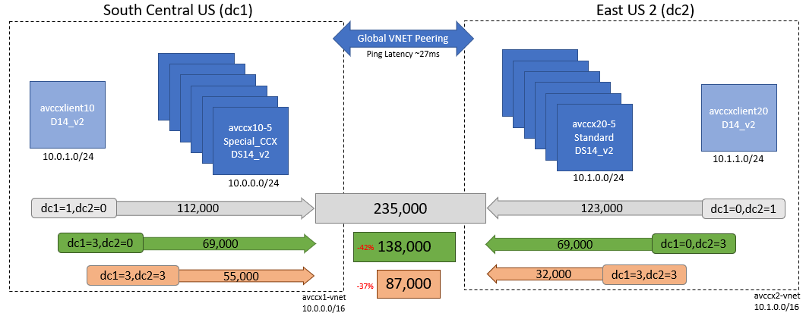

Two data centers are in separate regions (South Central US and East US 2) with approximately ~27ms round-trip latency between them. There are 6 nodes in each data center. As expected, even though writes are with Consistency Level of LOCAL_QUORUM, due to inter-region replication overhead, ops/s decrease when 2 DCs are replicating to each other.

In the two figures below, vertical axis is operations/second (higher is better) or latency in milliseconds (lower is better) and horizontal axis denotes independent or replicated DC and replication factor.

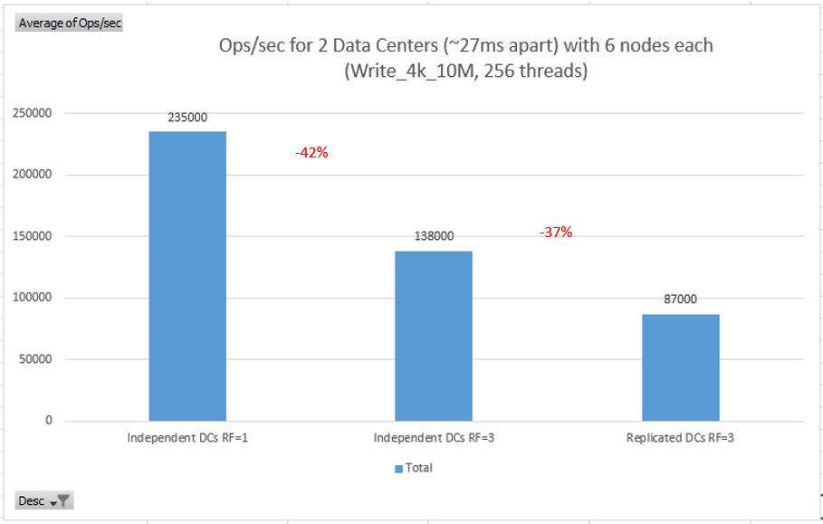

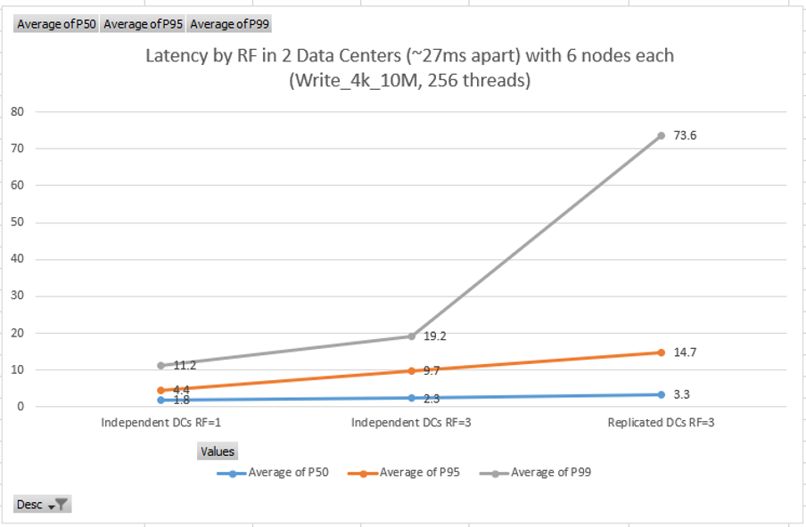

Output of "dstat -tam" command on DC1 nodes while running write test with 256 client threads. Top two rows are the client nodes nodes, with the 6 Cassandra nodes on the bottom. Based on the "net/eth0" send and receive throughput is around 150MB/s in each direction.

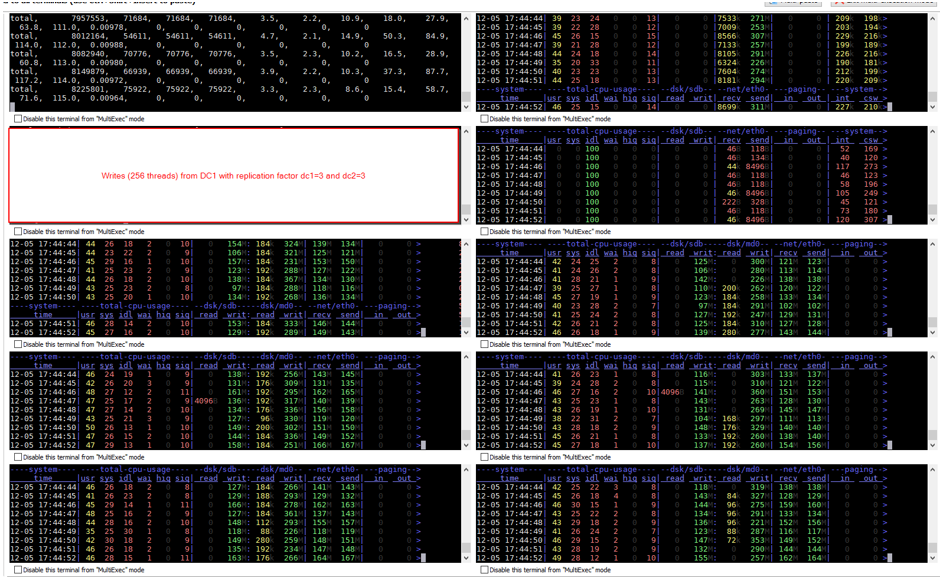

Sample cassandra-stress command used from each DC at the same time. The writes are going to separate keyspaces each replicated 3 times in each DC.

```
# 4k write (dc1=3, dc2=3) from DC1
cassandra-stress write no-warmup n=10000000 cl=LOCAL_QUORUM \
-rate threads=256 throttle=0/s \
-pop seq="1..10000000" -col size=FIXED\(818\) \
-node "10.0.0.4,10.0.0.5,10.0.0.6,10.0.0.7,10.0.0.8,10.0.0.9" \
-schema keyspace=ks410dc1dc2rf3 "replication(strategy=NetworkTopologyStrategy, dc1=3, dc2=3)" \
-log interval=1 -mode native cql3 connectionsPerHost=128

# 4k write (dc1=3, dc2=3) from DC2
cassandra-stress write no-warmup n=10000000 cl=LOCAL_QUORUM \
-rate threads=256 throttle=0/s \
-pop seq="1..10000000" -col size=FIXED\(818\) \
-node "10.1.0.4,10.1.0.5,10.1.0.6,10.1.0.7,10.1.0.8,10.1.0.9" \
-schema keyspace=ks410dc2dc1rf3 "replication(strategy=NetworkTopologyStrategy, dc1=3, dc2=3)" \
-log interval=1 -mode native cql3 connectionsPerHost=128
```

## Replicated 50/50 mixed read/write across 2 DCs

Two data centers are in separate regions with ~27ms round-trip latency. There are 6 nodes in each data center.

In the two figures below, vertical axis is operations/second (higher is better) or latency in milliseconds (lower is better) and horizontal axis denotes independent or replicated DC and replication factor.

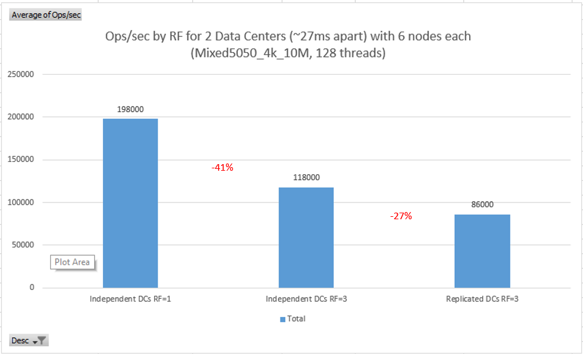

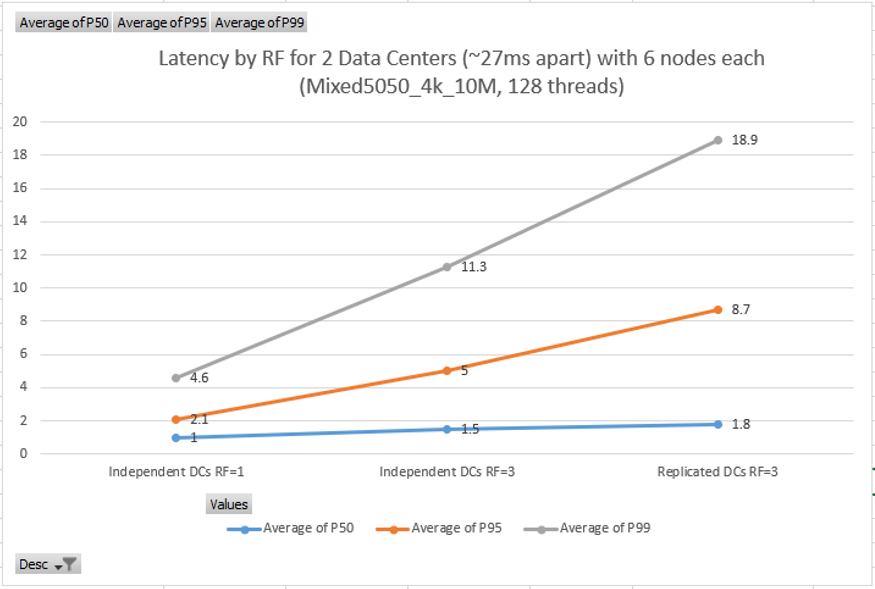

## Comparing LOCAL_QUORUM versus EACH_QUORUM for writes and reads across 2 DCs with RF=3

As expected, when using Consistency Level of EACH_QUORUM, performance is drastically reduced due to the 27ms round-trip latency between the data centers.

In the two figures below, vertical axis is operations/second (higher is better) or latency in milliseconds (lower is better) and horizontal axis denotes write vs. read tests.

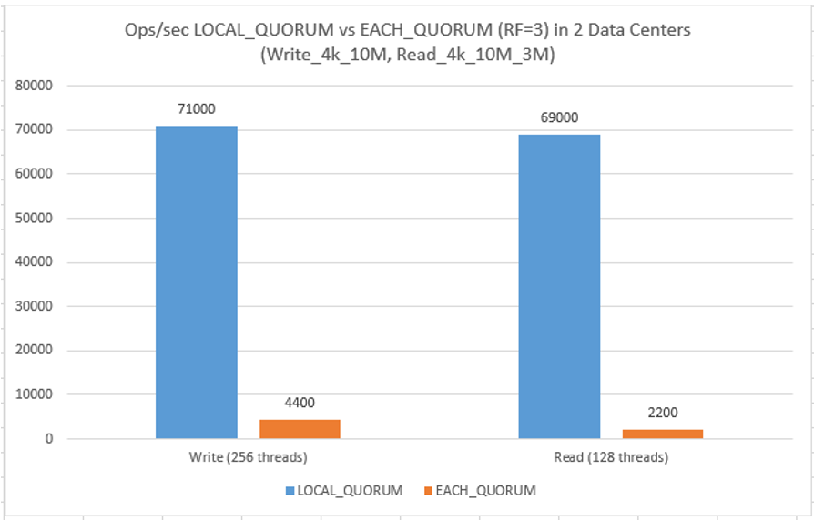

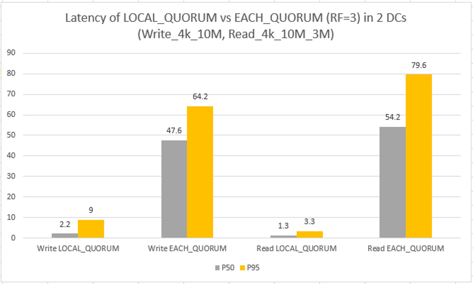

## Reads with Consistency Level of QUORUM (not LOCAL) have high latency

As expected, latency is high due to inter-DC traffic for QUORUM, but it stays consistent even as threads are increased. Additional client threads increase the ops/s due to Cassandra's parallelism (i.e. even though each operation takes longer due to inter-region latency, by increasing client threads we get higher ops/s)

In the two figures below, vertical axis is operations/second (higher is better) or latency in milliseconds (lower is better) and horizontal axis is the number of client threads.

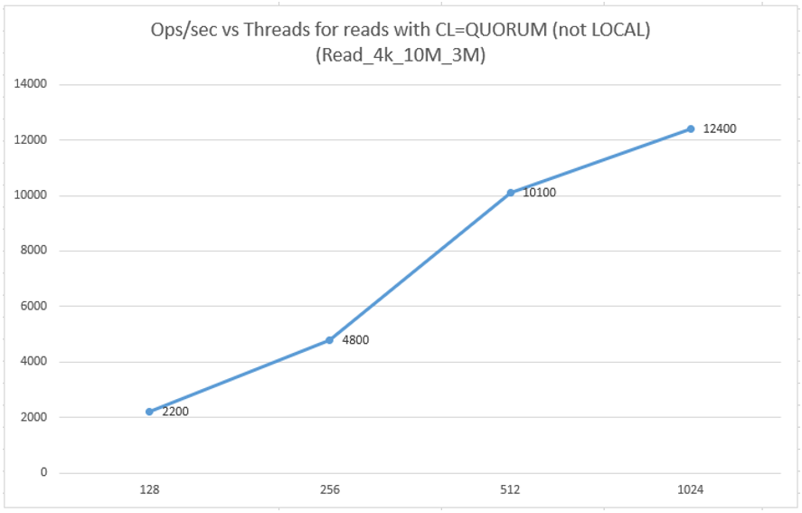

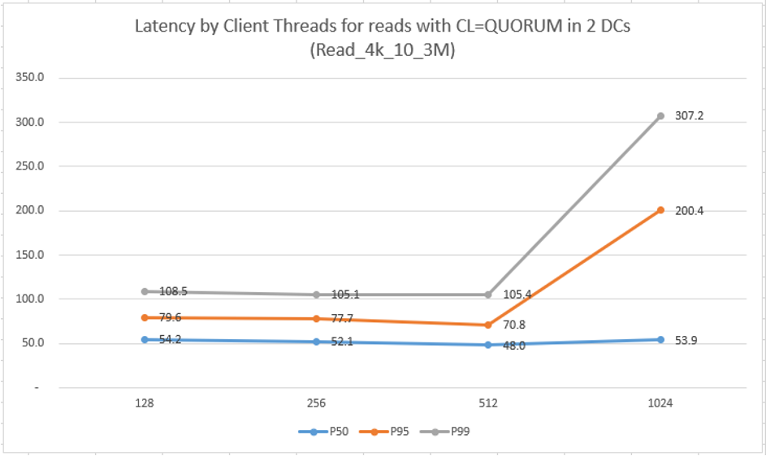

## Next

Return to [Learnings and Observations](../README.md#learnings-and-observations) table of contents