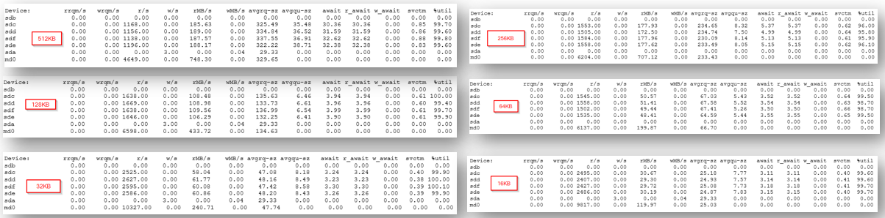
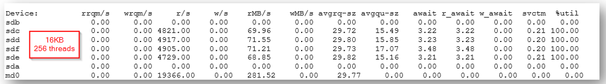
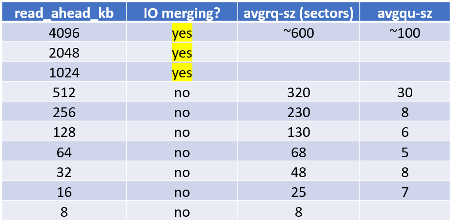
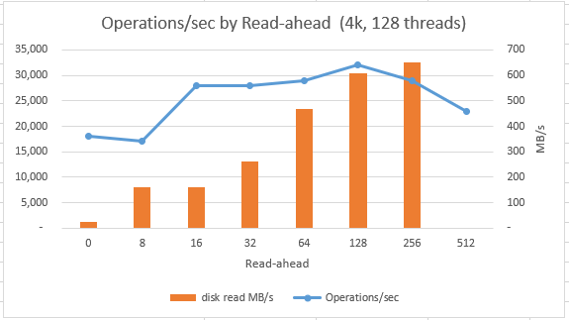
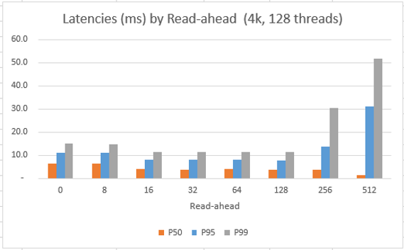
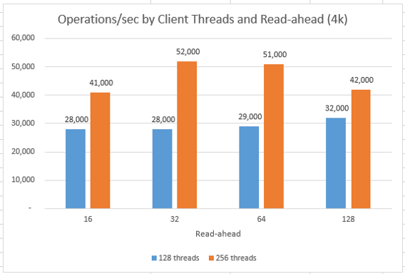

# Comparing impact of disk read-ahead settings

The [usual recommendation](https://docs.datastax.com/en/dse/5.1/dse-dev/datastax_enterprise/config/configOptimizeSsds.html) for Cassandra clusters using direct-attached SSDs, is to set the Linux device read_ahead_kb value to **8KB**. This is because Cassandra's read I/O is usually random and relatively small, and having a large read-ahead would waste throughput by reading parts of files that are not needed.

During initial read testing, we were running iostat and observed a lot of I/O merging in what appeared to be sequential I/O patterns, which was surprising since we expected to see random I/O during Cassandra reads. 

The cause for this was that in CentOS 7.5 the default read_ahead_kb is set to 4096 (i.e. 4MB), which is too large for random I/O workloads like Cassandra.

You can view your devices read ahead value using one of the following commands:

```
blockdev --getra /dev/{device}
cat /sys/class/block/{device}/queue/read_ahead_kb
```

When read-ahead is set to a high value, even when reading small documents (2KB, 4KB, etc), the random I/Os that are issued by Cassandra are merged at the lower layers of Linux I/O stack making them **appear** sequential.

For example, when 128 threads are reading 8K documents, read_ahead_kb makes a difference for the overall I/O pattern. As its value is decreased to 2048 and 1024, there is still "merging". However, after decreasing to 512 or lower the IOs are no longer merged and we see normal random I/O pattern in the sample iostat outputs below.



Below is an example of how reads/sec look for read_ahead_kb=64 when using 256 client threads instead of 128 as in the above screenshot. In this case, we see that reads/sec are reaching the maximum ~5000 IOPS per disk with 256 client threads, but 128 threads, in above screenshot, were not enough to push the disks hard enough.



Table below summarizes how various larger-than-recommended read-ahead settings affect the IO merging (i.e. making random IO look sequential) from iostat outputs:



When read-ahead is decreased to 8K, the iostat read pattern looks completely different. There are no merges, I/Os are random, sized at 8-sectors (4096 bytes) and VM-throttle is not reached.

## Read-ahead with Disk Caching = None

The following graphs show performance of reading 3M random records from a large 150M column family with document sized at 4k each. This is only reading 3M on purpose so that it compares the performance of cold reads and not after data is already in page cache (4xP30 disks, xfs on mdadm RAID0 with chunk size 64k).

Observe how large read-ahead values are "wasteful" and are causing more throughput to the remote disk (orange columns), but are not benefiting the ops/sec and are actually increasing the latencies.

In the figure below, the primary vertical axis for the blue-line is operations/second (higher is better), the secondary vertical axis for the orange bars is throughput in MB/s (lower is better for same ops/s) and the horizontal axis is the read-ahead value.


In the figure below, the primary vertical axis is latency in milliseconds (lower is better) and the horizontal axis is the read-ahead value. Latencies are shown as 50th, 95th, and 99th percentiles.


The following graph is showing how read-ahead influences ops/s (higher is better), for the same workload as above, when client threads are doubled from 128 to 256. When using 256 client threads, the ops/s taper off for read-ahead >= 64kb because VM is hitting its disk throughput limit.



## Conclusion

From additional testing, we observed that most Cassandra read-heavy workloads perform best with Azure data disk caching set to "ReadOnly", and in this configuration it is recommended to configure read-ahead as **8KB** to minimize "wasting" throughput for transferring data from disk when it is not necessary for the immediate read:

```
echo 0 > /sys/class/block/{device}/queue/rotational
echo 8 > /sys/class/block/{device}/queue/read_ahead_kb
```

## Next

Return to [Learnings and Observations](../README.md#learnings-and-observations) table of contents
