# Comparing relative performance of various replication factors

In the previous tests, we focused on specific tuning parameters like read-ahead, disk caching, chunk/stripe size, and therefore, purposely used keyspaces with Replication Factor (RF) of 1. However, most Cassandra production workloads use replication factor of 3 when using attached premium disks or even 5 when running using ephemeral disks.

Therefore, we also compared relative performance impact of various replication factors (1 through 6) in a single data center deployment.

## Replication Factor relative perf impact on WRITES with consistency level LOCAL_QUORUM

As the following two graphs show, write performance with RF=1 is much higher than with higher RF values. RF of 2 or 3 are almost the same because consistency level is LOCAL_QUORUM and 2 replicas must respond to the write for both RF 2 and 3.

In the figure below, vertical axis is operations/second (higher is better) and horizontal axis is the Replication Factor 1 through 6.

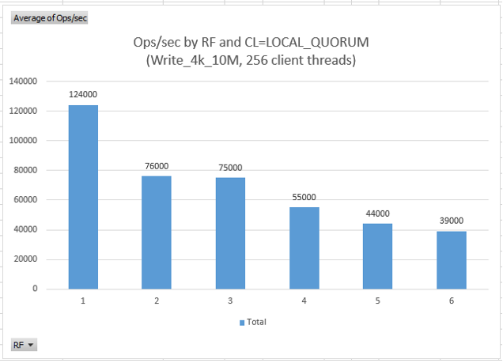

In the figure below, vertical axis is latency in milliseconds (lower is better) and horizontal axis is the Replication Factor 1 through 6. Latencies are shown as percentile 50, 95, and 99.

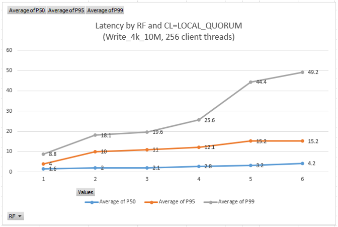

The following graphs confirm that RF=1 and RF=3 behave similarly based on number of client threads performing the writes. The ops/s tapers off as threads are increased above ~256.

In the figures below, vertical axis is operations/second (higher is better) and latency in milliseconds (lower is better) and horizontal axis is the number of client threads used for the write test. Blue line is Replication Factor RF=1 and orange line is RF=3.

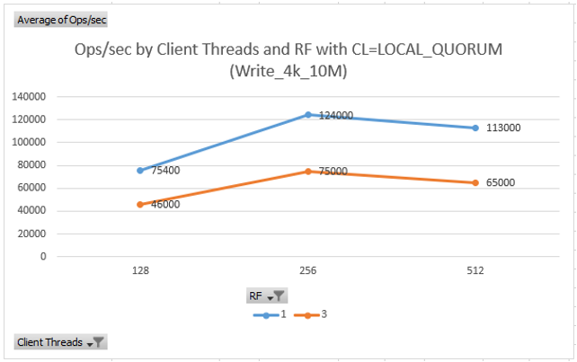

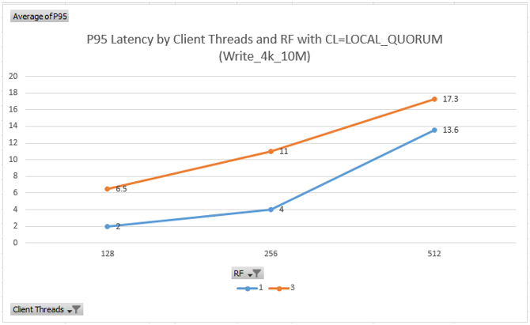

Sample cassandra-stress commands used for write tests of replication factors 1, 2, 3, etc.
```
# 4k write RF=1
cassandra-stress write no-warmup n=10000000 cl=LOCAL_QUORUM \
-rate threads=256 throttle=0/s \
-pop seq="1..10000000" -col size=FIXED\(818\) \
-node "10.0.0.4,10.0.0.5,10.0.0.6,10.0.0.7,10.0.0.8,10.0.0.9" \
-schema keyspace=ks410rf1 "replication(strategy=NetworkTopologyStrategy, dc1=1)" \
-log interval=1 -mode native cql3 connectionsPerHost=128 -graph file=write_10m.html title=write_10m revision=rf1_a

# 4k write RF=2
cassandra-stress write no-warmup n=10000000 cl=LOCAL_QUORUM \
-rate threads=256 throttle=0/s \
-pop seq="1..10000000" -col size=FIXED\(818\) \
-node "10.0.0.4,10.0.0.5,10.0.0.6,10.0.0.7,10.0.0.8,10.0.0.9" \
-schema keyspace=ks410rf2 "replication(strategy=NetworkTopologyStrategy, dc1=2)" \
-log interval=1 -mode native cql3 connectionsPerHost=128 -graph file=write_10m.html title=write_10m revision=rf2_a

# 4k write RF=3
cassandra-stress write no-warmup n=10000000 cl=LOCAL_QUORUM \
-rate threads=256 throttle=0/s \
-pop seq="1..10000000" -col size=FIXED\(818\) \
-node "10.0.0.4,10.0.0.5,10.0.0.6,10.0.0.7,10.0.0.8,10.0.0.9" \
-schema keyspace=ks410rf3 "replication(strategy=NetworkTopologyStrategy, dc1=3)" \
-log interval=1 -mode native cql3 connectionsPerHost=128 -graph file=write_10m_512t.html title=write_10m revision=rf3_a
```

Graph generated by cassandra-stress run showing relative ops/s performance when writing 10M of 4k documents

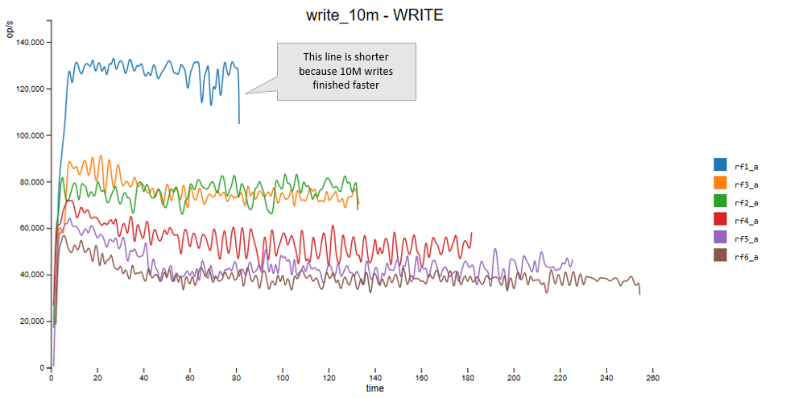

## Replication Factor relative performance impact on READS with consistency level LOCAL_QUORUM

Run "a" is the first execution when data is not yet cached by Cassandra nor Linux page cache. Run "b" is the second execution of the same test when more of the data is cached.

The impact of RF is **more** pronounced in run "b" because in run "a" the gating factor is the time it takes to read the data from disks, while in run "b" part of the data is already in memory and reading replicas over the network is what causes the relative difference in ops/s between RF=1 and RF>1.

In the two figure below, vertical axis is operations/second (higher is better) or latency in milliseconds (lower is better), horizontal axis denote runs "a" and "b", and various colored bars are different replication factors.

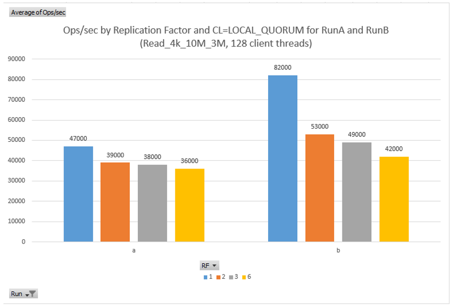

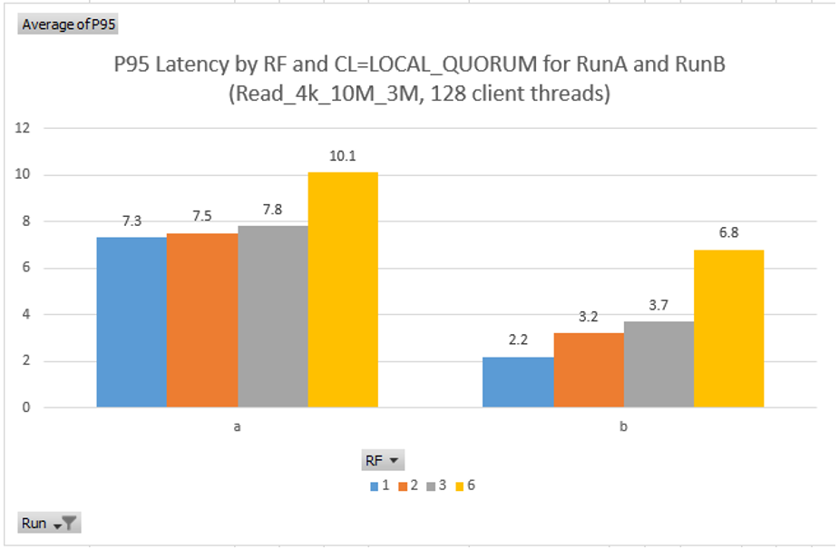

Sample cassandra-stress commands used for reads tests of replication factors 1, 2, 3, etc.
```
# 4k read RF=1
cassandra-stress read no-warmup n=3000000 cl=LOCAL_QUORUM \
-rate threads=128 throttle=0/s \
-pop dist=uniform\("1..10000000"\) -col size=FIXED\(818\) \
-node "10.0.0.4,10.0.0.5,10.0.0.6,10.0.0.7,10.0.0.8,10.0.0.9" \
-schema keyspace=ks410rf1 \
-graph file=read_10m.html title=read_10m revision=rf1_a \
-log interval=1 -mode native cql3 connectionsPerHost=128

# 4k read RF=2
cassandra-stress read no-warmup n=3000000 cl=LOCAL_QUORUM \
-rate threads=128 throttle=0/s \
-pop dist=uniform\("1..10000000"\) -col size=FIXED\(818\) \
-node "10.0.0.4,10.0.0.5,10.0.0.6,10.0.0.7,10.0.0.8,10.0.0.9" \
-schema keyspace=ks410rf2 \
-graph file=read_10m.html title=read_10m revision=rf2_a \
-log interval=1 -mode native cql3 connectionsPerHost=128

# 4k read RF=3
cassandra-stress read no-warmup n=3000000 cl=LOCAL_QUORUM \
-rate threads=128 throttle=0/s \
-pop dist=uniform\("1..10000000"\) -col size=FIXED\(818\) \
-node "10.0.0.4,10.0.0.5,10.0.0.6,10.0.0.7,10.0.0.8,10.0.0.9" \
-schema keyspace=ks410rf3 \
-graph file=read_10m.html title=read_10m revision=rf3_a \
-log interval=1 -mode native cql3 connectionsPerHost=128
```

## Consistency Level performance difference for keyspace with RF=3

As expected, when using Consistency Level=1, 76k ops/s is very close to 82k for run "b" with RF=1 since CL=1 reads from only one of the 3 replicas similar to RF=1. Also, when using CL=2, 52k ops/s is very close to 53k or 49k from run "b" with RF=3 since CL=2 reads from 2 replicas which is same number required when doing a LOCAL_QUORUM read from RF=3.

In the two figure below, vertical axis is operations/second (higher is better) or latency in milliseconds (lower is better), horizontal axis denote read test runs with Consistency Levels (CL) of 1, 2, and 3.

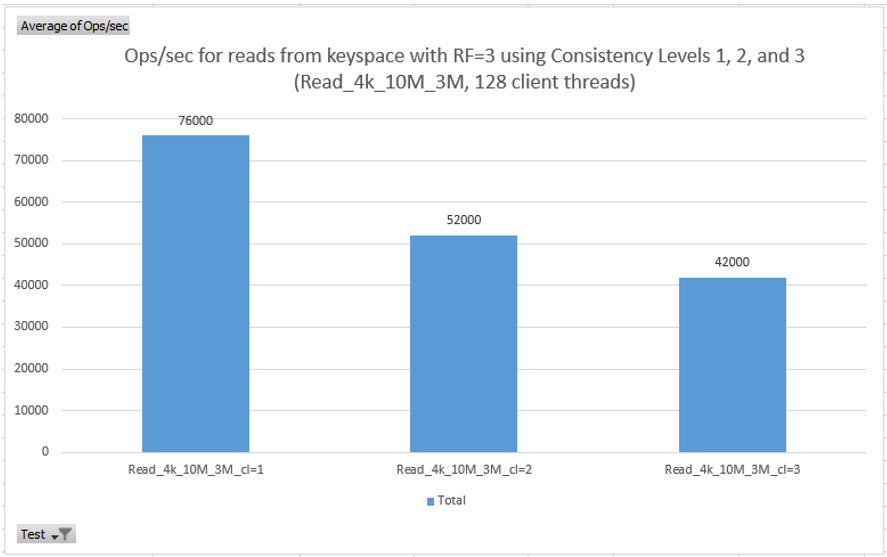

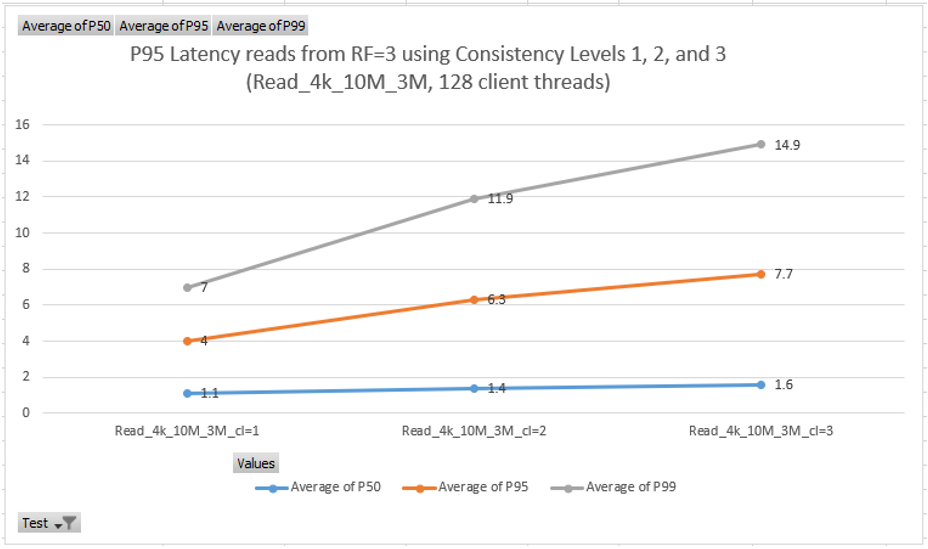

Graph below shows how ops/s look when reading 3M out of 10M 4k documents with consistency levels 1, 2, and 3.

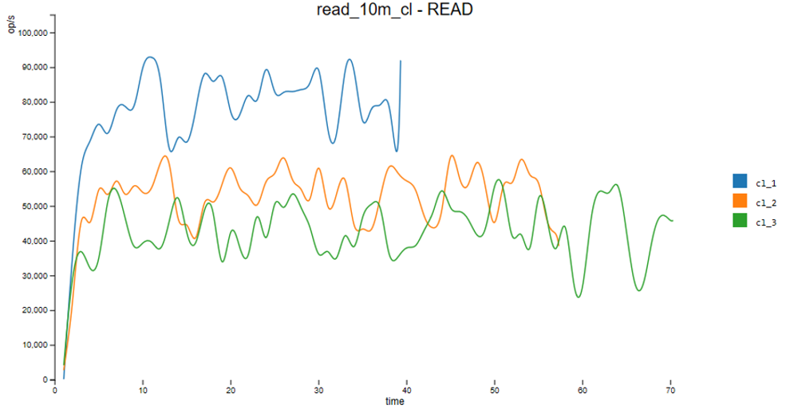

## Replication Factor relative performance impact on a 50/50 mixed read/write with consistency level LOCAL_QUORUM

50/50 mixed workload consisted of 50% reads and 50% writes to the same keyspace with replication factors of 1, 3, and 5. As with the write and read workload, mixed workload shows the expected impact of increased replication factor.

In the two figure below, vertical axis is operations/second (higher is better) or latency in milliseconds (lower is better), horizontal axis denotes the Replication Factor (RF) of 1, 3, and 5.

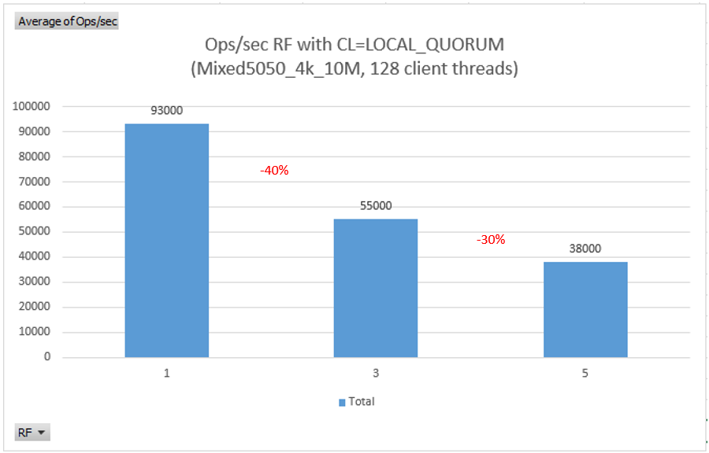

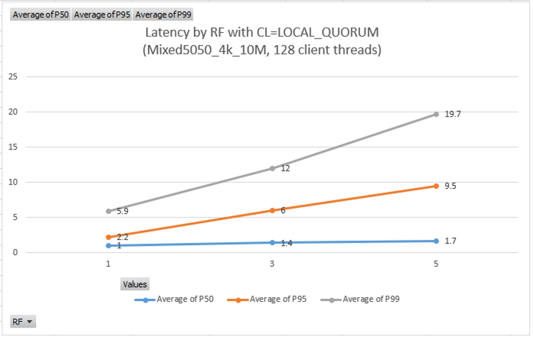

Sample cassandra-stress command used for mixed read/write test

```
cassandra-stress mixed ratio\(write=1,read=1\) no-warmup n=3000000 cl=LOCAL_QUORUM \
-rate threads=128 throttle=0/s \
-pop dist=uniform\("1..10000000"\) -col size=FIXED\(818\) \
-node "10.0.0.4,10.0.0.5,10.0.0.6,10.0.0.7,10.0.0.8,10.0.0.9" \
-schema keyspace=ks410rf1 \
-log interval=1 -mode native cql3 connectionsPerHost=128
```

## Next

Return to [Learnings and Observations](../README.md#learnings-and-observations) table of contents